```{r setup, include=FALSE}
options(htmltools.dir.version = FALSE)
knitr::opts_chunk$set(echo = FALSE, tidy = TRUE, message = FALSE, warning = FALSE, dev = 'png', fig.width = 14, fig.height=9, fig.align='center', cache = TRUE)
```

```{r packages}
library(tidyverse)
library(geomnet)
library(RSiena)
library(lme4)
library(vinference)
```

```{r loaddata, cache=T,  results='hide'}
load("data/finalglmm31-2.RDA")
mod <- model2randomscalesize
turk22 <- read_csv("data/turk22-sig.csv")
load("data/se112adjmat.RDS")
wave2 <- data.frame(se112adj)
senators <- data.frame(id = colnames(wave2), number = 1:155)
wave2$from <- colnames(wave2)
wave2 <- wave2 %>% gather(to, val, Alan.Stuart.Franken:William.Cowan) %>% filter(val > 0)
wave2 <- merge(wave2, senators, by.x = "from", by.y = "id", all = T)
wave2$from <- senators$number[match(wave2$from, senators$id)]
wave2$to <- senators$number[match(wave2$to, senators$id)]
wave2$from <- paste0("V", wave2$from)
wave2$to <- ifelse(is.na(wave2$to), NA, paste0("V", wave2$to))
wave2 <- wave2 %>% mutate(sim = 1001, model = "data", wave = 1) %>% select(-c(val, number))
source("code/snijdersmodavg.R")
```

# Updates

Publications: 

- **Tyner, S.**, Briatte, F. and Hofmann, H. "Network Visualization with ggplot2." *The R Journal*. 9:1, 27-54, URL: https://journal.r-project.org/archive/2017/RJ-2017-023/index.html  
--

- **Sam Tyner** (2016) "Using the R Package geomnet: Visualizing Trans-Atlantic
Slave Trade of Africans, 1514-1866," *CHANCE*, 29:3, 4-16, DOI: 10.1080/09332480.2016.1234879

---

# Updates

Post-graduation plans:

- Become a post-doctoral researcher in CSAFE at Iowa State working on human factors: 
    * Develop training materials for judges, lawyers, & practitioners 
    * Design and conduct mock jury studies
    * Open source, reproducible research in forensics
    
---

# Outline 

- Remaining Chapter 3 material
- Chapter 2 

???
Chapter 3 : "VISUAL INFERENCE FOR SIGNIFICANCE AND GOODNESS-OF-FIT TESTING OF STOCHASTIC ACTOR-ORIENTED MODELS"
- Remaining results from MTurk Experiment
- Shiny app for creating lineups
- Shiny app for visual inference experiment
Chapter 2: 
- Model Visualization for SAOMs
    * Model-in-data-space vs. Data-in-model-space
    * Collections of models
    * Exploring algorithms 
- Developing animations: *netvizinf* package 

---
class: inverse, center, middle

# Results (continued)

---
class: majorpoint

# Recall: hypotheses for significance test

For $k \in \{3, 4\}$

$H_0$: $\beta_k = 0$

$H_A$: $\beta_k \neq 0$

**Null model** for generating 5 null plots in the lineup: M1 ( $\beta_1 = \hat{\beta}_1, \beta_2 =\hat{\beta}_2$ )

**Alternative model** for generating 1 alternative plot in the lineup: 

- M3 ( $\beta_1 = \hat{\beta}_1, \beta_2 =\hat{\beta}_2, \beta_3 =\hat{\beta}_3$ ) or 
- M4 ( $\beta_1 = \hat{\beta}_1, \beta_2 =\hat{\beta}_2, \beta_4 =\hat{\beta}_4$ )

---

# Significance tests for M3, M4

- $p$-values calculated using the *vinference* package (Hofmann and Röttger, 2016)

```{r sigres, results='asis'}
turk22_sig <- turk22 %>% 
  mutate(type2 = ifelse(sign == 0, sign(initialEst), sign),
         type2 = ifelse(type == "one", type2, -1)) %>% 
  filter(param_value == 1)
summ_sig <- turk22_sig %>% group_by(pic_id, test_param) %>% 
  summarize(npick = sum(datapick), n = n(), 
            pv = map2_dbl(npick, n, pV, m=6, scenario=3))
names(summ_sig) <- c("Lineup ID", "parameter", "# Alt. Model Picks", "Total Views", "p-value")
summ_sig$parameter <- as.factor(summ_sig$parameter)
levels(summ_sig$parameter) <- paste0("&beta;<sub>", c(3,4), "</sub>")
knitr::kable(summ_sig, format = "markdown", digits = c(0,0,0,0,5))
```

---
class: plotslide

# Significance tests - $\beta_3$, rep. 1. Null model: M1, Alt. model: M3

- 4/29 chose alternative data plot (#2)

```{r sigjttp1}
dat <- read_csv("data/jttp_pos_hard_1.csv")
ggplot(data = dat) + 
        geom_net(aes(from_id = from, to_id = to), 
                 arrow = arrow(type = 'open', length = unit(2, "points") ), 
                 linewidth = .25, singletons = T, fiteach = T, directed = T, 
                 color = 'black', arrowgap = .015, arrowsize = .3, size =1) + 
        theme_net() + 
        theme(panel.background = element_rect(color = 'black'),
              strip.text = element_text(size = 20)) +
        facet_wrap(~ord)
```

---
class: plotslide

# Significance tests - $\beta_3$, rep. 2  Null model: M1, Alt. model: M3

- 26/31 chose alternative data plot (#3)

```{r sigjttp2}
dat <- read_csv("data/jttp_pos_hard_2.csv")
ggplot(data = dat) + 
        geom_net(aes(from_id = from, to_id = to), 
                 arrow = arrow(type = 'open', length = unit(2, "points") ), 
                 linewidth = .25, singletons = T, fiteach = T, directed = T, 
                 color = 'black', arrowgap = .015, arrowsize = .3, size =1) + 
        theme_net() + 
        theme(panel.background = element_rect(color = 'black'),
              strip.text = element_text(size = 20)) +
        facet_wrap(~ord)
```

---
class: plotslide

# Significance tests - $\beta_3$, rep. 3  Null model: M1, Alt. model: M3

- 2/27 chose alternative data plot (#1)

```{r sigjttp3}
dat <- read_csv("data/jttp_pos_hard_3.csv")
ggplot(data = dat) + 
        geom_net(aes(from_id = from, to_id = to), 
                 arrow = arrow(type = 'open', length = unit(2, "points") ), 
                 linewidth = .25, singletons = T, fiteach = T, directed = T, 
                 color = 'black', arrowgap = .015, arrowsize = .3, size =1) + 
        theme_net() + 
        theme(panel.background = element_rect(color = 'black'),
              strip.text = element_text(size = 20)) +
        facet_wrap(~ord)
```

---

# Recall: Hypotheses for goodness-of-fit test

For $i$ in $\{3,4,6, 7\}$

$H_0$: Model M $i$ generated the network data

$H_A$: The network data do not come from the null model. 

**Null model** for generating 5 null plots in the lineup: 

- M3 ( $\beta_1 = \hat{\beta}_1, \beta_2 =\hat{\beta}_2, \beta_3 =\hat{\beta}_3$ ) or 
- M4  ( $\beta_1 = \hat{\beta}_1, \beta_2 =\hat{\beta}_2, \beta_4 =\hat{\beta}_4$ ) or 
- M5 ( $\beta_1 = \hat{\beta}_1, \beta_2 = \hat{\beta_2}, \beta_5 = \hat{\beta}_5$ ) or 
- M7 ( $\beta_1 = \hat{\beta}_1, \beta_2 =\hat{\beta}_2, \beta_4 =\hat{\beta}_4, \beta_5 =\hat{\beta}_5,\beta_6 =\hat{\beta}_6$ )

**Alternative model**: unknown, use the data as the alternative plot

---

# Goodness-of-fit tests

- $p$-values calculated using the *vinference* package (Hofmann and Röttger, 2016)

```{r gof, results='asis'}
turk22_gof <- read_csv("data/turk22-gof.csv")
turk22_gof_stats <- turk22_gof %>% group_by(pic_id) %>% 
  summarize(npickdata = sum(datapick), total = n(), 
          pvinf = map2_dbl(npickdata, total, pV, m = 6, scenario = 3))
turk22_gof_stats %>% separate(pic_id, into = c("discard", "model", "rep"), sep = c(2,3)) -> print_gof_stats
print_gof_stats %>% select(-discard) %>% mutate(model = paste0("M", (as.integer(model))))-> print_gof_stats
names(print_gof_stats) <- c("Model", "Replicate", "Data Picks", "Total Viewers", "p-value")
print_gof_stats$`p-value` <- ifelse(print_gof_stats$`p-value` < .0001, "< 0.0001", as.character(round(print_gof_stats$`p-value`,4)))
knitr::kable(print_gof_stats, format="markdown", digits = 4, align = c("l", "c", "c", "c", "r"))
```

---
class: plotslide

# Goodness-of-fit test: M7, rep 1

- 17/20 selected the data 

```{r}
dat <- read_csv(paste0("data/bigmod_gof_9_1.csv"))
datplot <- unique(dat$ord[dat$sim == 1001])
dat <- dat %>% filter(sim != 1001) %>% 
      bind_rows(wave2) %>% 
      mutate(ord = ifelse(is.na(ord), datplot, ord))
ggplot(data = dat) + 
        geom_net(aes(from_id = from, to_id = to), 
                 arrow = arrow(type = 'open', length = unit(2, "points") ), 
                 linewidth = .25, singletons = T, fiteach = T, directed = T, 
                 color = 'black', arrowgap = .015, arrowsize = .3, size =1) + 
        theme_net() + 
        theme(panel.background = element_rect(color = 'black'),
              strip.text = element_text(size = 20)) +
        facet_wrap(~ord)
```

---
class: plotslide

# Recall: Hypothesis for power

```{r hyppower3, fig.height=8, fig.width=13, fig.align='center'}
x <- seq(-10, 10, .05)
N <- length(x)
ggplot() + 
  geom_line(data = NULL, aes(x = 1:N, y = pt(x, 1))) + 
  geom_line(data = NULL, aes(x = -(1:N), pt(x,1))) + 
  scale_x_continuous(name = "Parameter Value", labels = c("very negative", "negative", "0", "positive", "very positive")) + 
  geom_hline(yintercept = 1/10, linetype = 'dotted') +
  geom_vline(xintercept = 0) + 
  geom_label(data = NULL, aes(x = 0, y = .9, label = "Null Model = Alt. Model"), size = 7) +
  geom_rect(data=NULL, aes(xmin = -250, xmax = -140, ymin = 0.1, ymax=.9), fill = "red", color = "grey40", alpha = .2) +
  geom_rect(data=NULL, aes(xmin = 140, xmax = 250, ymin = 0.1, ymax=.9), fill = "red", color = "grey40", alpha = .2) +
 geom_vline(xintercept = c(-250,-140, 140, 250)) + 
  scale_y_continuous(name = "% detecting plot from\nthe alternative model", labels = paste0(c(0,25,50,75,100), "%")) + 
  theme_bw() + 
  theme(text = element_text(size = rel(5)))
```

---

# Sources of variability

- Model M1
- Model M3
- Small number of null models 
- Need more repititions: 3 is not enough


---
class: inverse, center, middle

# App for creating lineups

---

# Screen grab

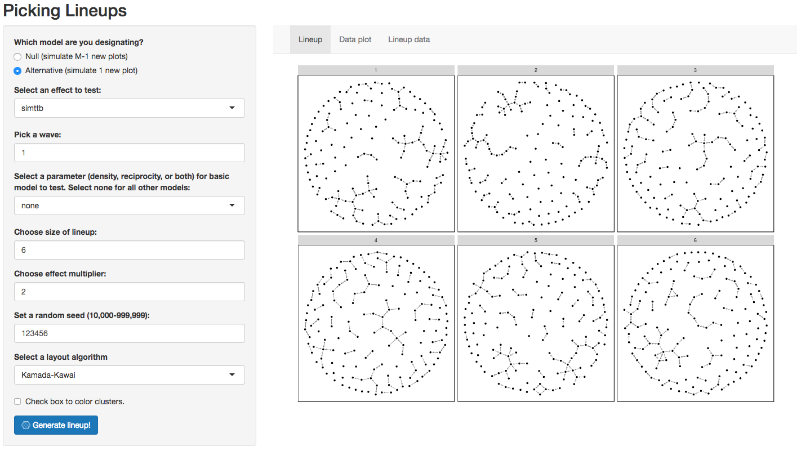

---

# Live demo 🤞

https://sctyner.shinyapps.io/saom_lineup_creation/ 

Source code: https://github.com/sctyner/NetworksVizInference/tree/master/shinyApp 

---
class: inverse, center, middle

# Shiny app for visual inference experiment

---

# Intructions

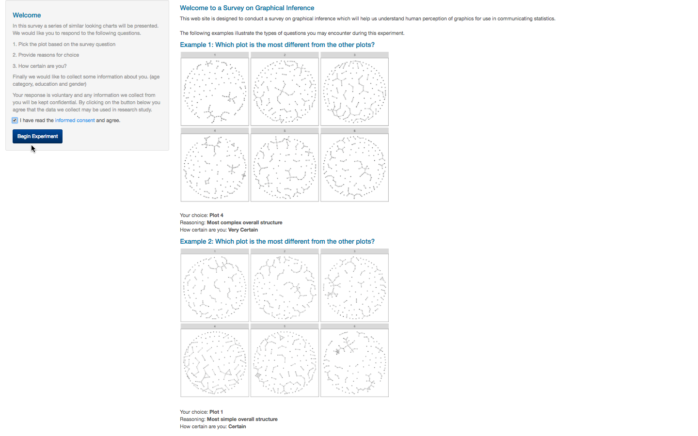

---

# Training Example - Most Simple

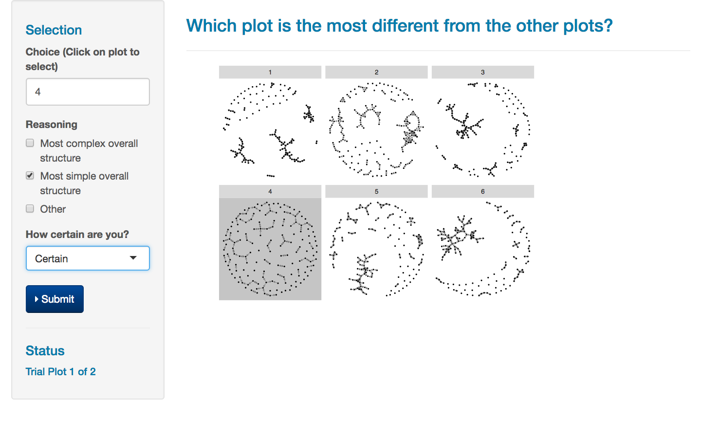

---

# Training Example - Most Complex

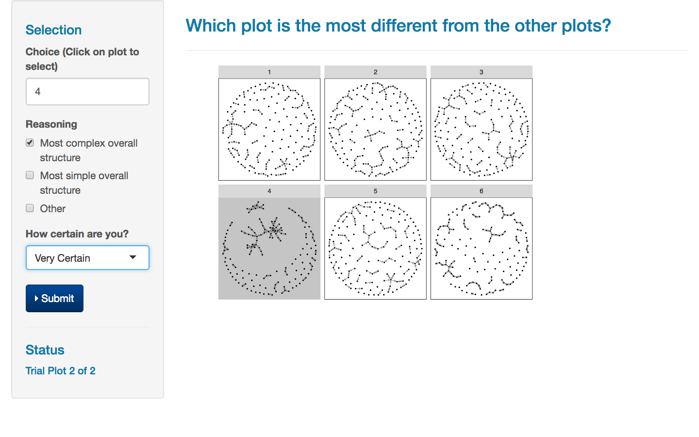

---
class: inverse, center, middle

# Model Visualization for SAOMs

---
class: definition

# Model visualization 

## Model visualization summarizes the model with graphical, as opposed to numerical summaries to answer questions of interest

---

# Questions

1. What does the model look like? 
2. How does the model change when its parameters change? 
3. How do the parameters change when the data is changed?
4. How well does the model fit the data? 
5. How does the shape of the model compare to the shape of the data? 
6. Is the model fitting uniformly good, or good in some regions but poor in other regions? Where might the fit be improved?

???
Number 1, 2 & 4 - demonstrated a bit in the previous talk with lineups
Expand on 1,2,4 and get into 3,5,6 in this talk

---

# How? 

Three main approaches: 

- View the model in the data-space
- View collections of models
- Exploring algorithms 

---

# The Data

- Subset of Michell and Amos (1997)

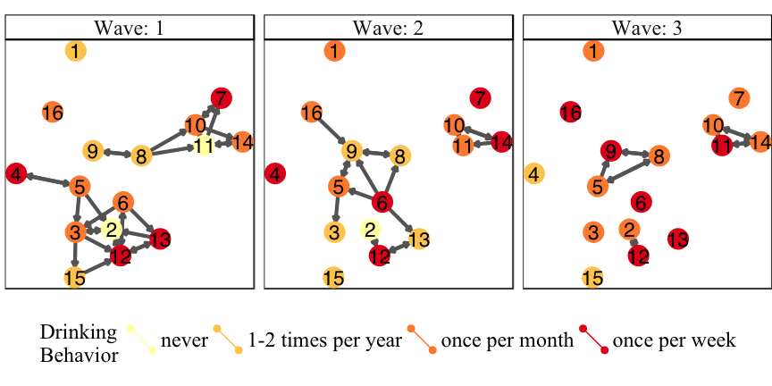

---
class: math

# The Models 

SAOMs with rate parameter $\alpha_m$ and different objective functions:

- Model M1: $f_{i}(x, \boldsymbol{\beta}) = \beta_1 s_{i1}(x) + \beta_2 s_{i2}(x)$
- Model M2: $f_i(x, \boldsymbol{\beta}, \mathbf{z}) = \beta_1 s_{i1}(x) + \beta_2 s_{i2}(x) + \beta_3s_{i3}(x, \mathbf{z})$
- Model M3: $f_i(x) = \beta_1 s_{i1}(x) + \beta_2 s_{i2}(x) + \beta_7s_{i7}(x)$ 
- $\mathbf{z}$ is the drinking behavior of the students
---
class: center

# $\beta_7$

$$s_{i7}(x) = |\{k : x_{ik} = 0, \sum\limits_h x_{ih}x_{hk} \geq 2\}|$$

```{r dad2, fig.height=2, fig.width=2, fig.align='center'}
dade <- data.frame(from = c('i', 'i', 'h', 'j', 'i'), to = c('h', 'j', 'k', 'k','k'))
dadn <- data.frame(id = letters[8:11], group = c(1,1,1,1))

dad <- merge(dade, dadn, by.x = 'from', by.y = "id", all = T)

set.seed(12345)
ggplot(data = dad, aes(from_id = from, to_id = to)) +
  geom_net(directed = T, labelon = T,
           ecolour = c("black", "black", "black","red", "black" ,"black" ),
           labelcolour='grey80',vjust = 0.5, hjust =0.5, arrowgap = .15, size=10, fontsize = 5) +
  expand_limits(x=c(-0.1,1.1), y=c(-0.1,1.1)) +
  theme_net() +
  theme(legend.position = "none")
```

---
class: inverse, center, middle

# Model-vis Principle #1: Model in Data Space

---
class: definition 

# Model in the data space

## "Visualizing the model in the context of the data [by] displaying the model in the high-dimensional data space" (Wickham et al., 2015)

???
Example: for linear regression, viewing the whole regression surface

---
class: definition

# Data in the model space

## Visualizing the data in a "low-dimensional space generated by the model" (Wickham et al., 2015)

???
For example, residual plots for a regression

---

# What do m-in-ds and d-in-ms mean for network data? 

Three data spaces for dynamic network data

1. The actors and their covariates
2. The edges and their variables describing the ties between the nodes
3. The time, both the continuous unobserved time and the discrete observed time points, over which the network evolves

---

# Combining the three data spaces

- Node-link visualization to combine node and edge data spaces 
- Side-by-side node-link diagrams for capturing the time data space

???
Node-link uses one of many algorithms to layout the actors as points in 2D space, then draws segments connecting the points in 2D if there is an edge between two nodes, and draws nothing otherwise.

---
class: plotslide

# Node-link diagram: m-in-ds

- Simulate wave 2 1,000 times from M1 
- Count number of times edges occur
- Create "average" network 

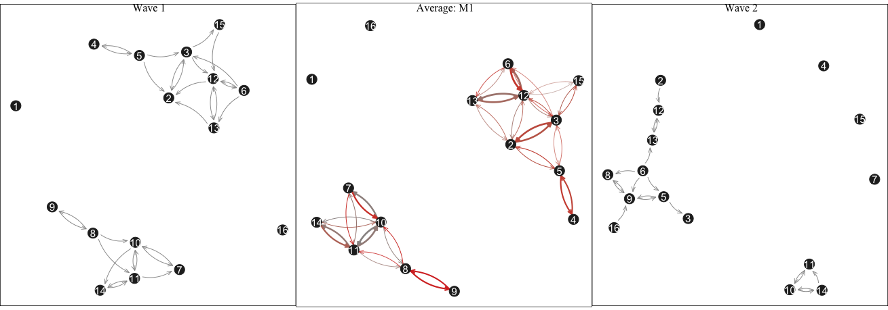

---

class: plotslide

# Goodness of fit: d-in-ms

- Data outdegree counts among the same simulations from M1

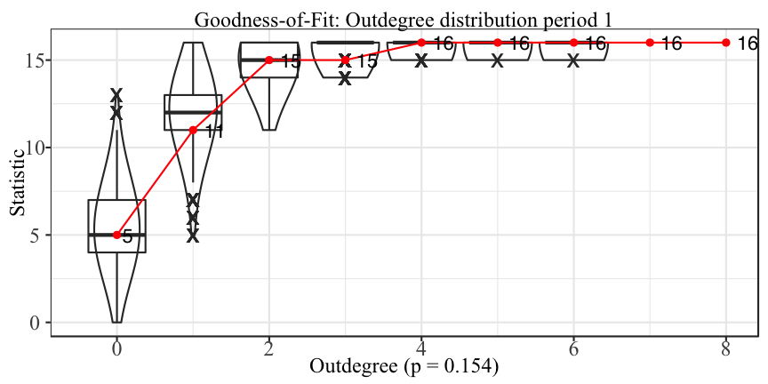

???
Take the data, derive a feautre. Then look at the distribution of that feature from the model, where does the data fit in

---
class: majorpoint

# M-in-DS vs. D-in-MS

- data in model space approach: model does not appears to be a bad fit to the data 
- model in data space approach: model appears to be a poor fit to the data

??? 
D in MS: fail to reject null
M in DS: reject null 


---
class: inverse, middle, center

# Model-vis Principle #2: View collections of models

---

# How? 

- Explore the space of all possible models
- Vary model settings
- Fit same model form to different data
- Fit one model to same data many times

---

# Explore the space of all possible models

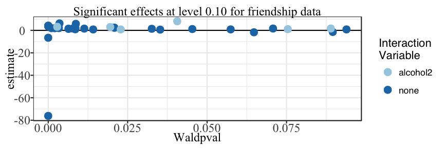

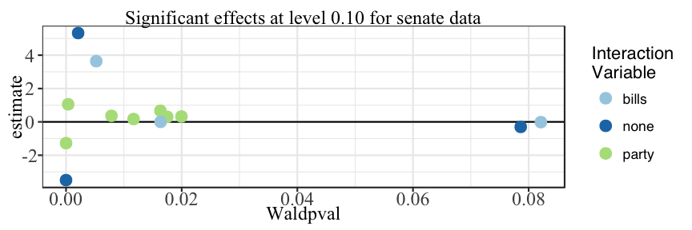


---

# Vary model settings

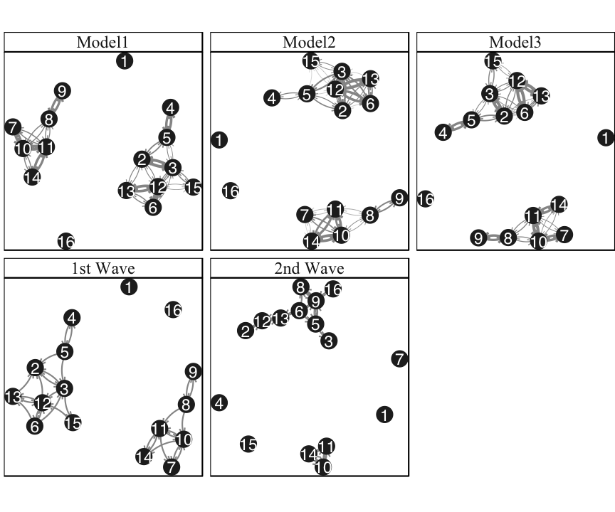

???
Look at: 10-11-14; 9; 1, 16, and 7

---

# Fit same model form to different data

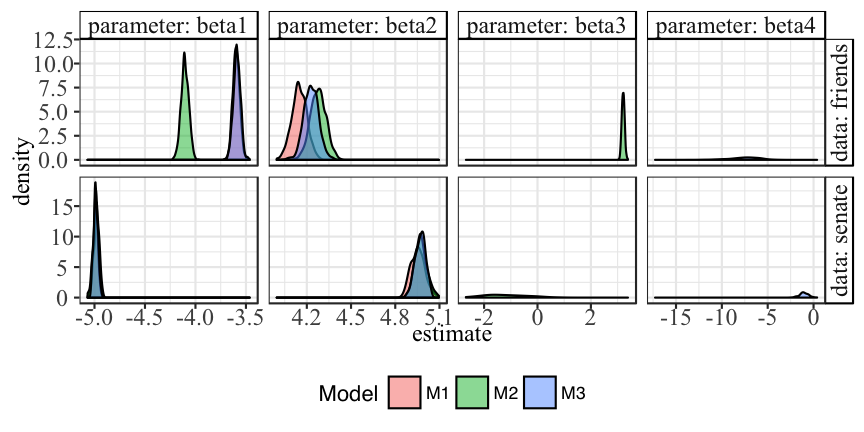

---

# Fit one model to same data many times

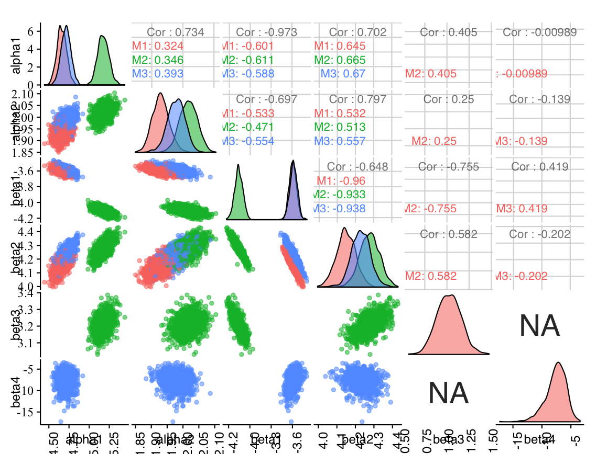


---
class: inverse, middle, center

# Model-vis Principle #3: Exploring algorithms

---
class: plotslide

# First step in the microstep process

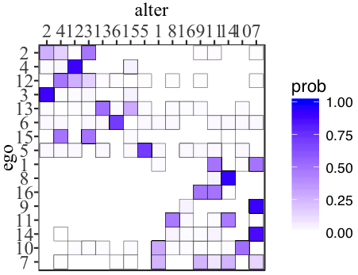

???
Recall the underlying CTMC process: this is just the first step in that process for 1000 simulations

---
class: plotslide

# Displaying underlying CTMC: Node-link

<iframe src="https://player.vimeo.com/video/240089108" width="640" height="550" frameborder="0" webkitallowfullscreen mozallowfullscreen allowfullscreen></iframe> <p><a href="https://vimeo.com/240089108">SAOM Microstep Node-Link Animation</a> from <a href="https://vimeo.com/sctyner">Sam Tyner</a> on <a href="https://vimeo.com">Vimeo</a>.</p>

???
layout is terrible
nodes disappear

---
class: plotslide

# Displaying underlying CTMC: Adjacency matrix

<iframe src="https://player.vimeo.com/video/240092677" width="640" height="500" frameborder="0" webkitallowfullscreen mozallowfullscreen allowfullscreen></iframe> <p><a href="https://vimeo.com/240092677">SAOM Microstep Adjacency Matrix Animation</a> from <a href="https://vimeo.com/sctyner">Sam Tyner</a> on <a href="https://vimeo.com">Vimeo</a>.</p>

???
note symmetry. not required. due to high reciprocity parameter.

---
class: plotslide

# Displaying many CTMCs

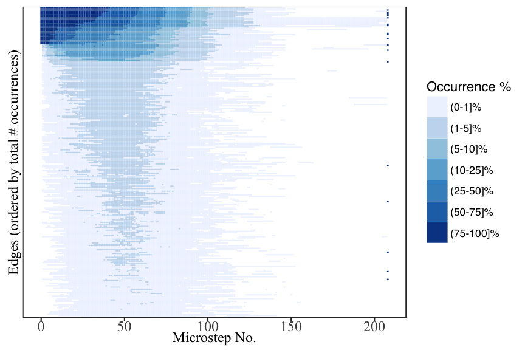


---
class: inverse, center, middle

# Developing animations: *netvizinf* package 

---

# Package information

- https://github.com/sctyner/netvizinf 
- Install in R: *devtools::install("sctyner/netvizinf")*
- Contains functions for 
    * simulating from SAO models 
    * convert network simulations from *RSiena* into tidy data frames
    * creating "average" networks 
    * series of functions to create the node-link animation with the help of the *tweenr* package (Pedersen, 2016)
    
---
class: inverse, center, middle

# Conclusion 

---

# Summary of Research

- Model visualization helps unveil: 
    * unseen patterns in SAOMs 
    * algorithm behavior
    * model coverage
    * new methods for goodness-of-fit
- New tools created for visualization and exploration:
    * animation of network change
    * app for lineup creation (can be generalized)
- Lessons learned
    * correlation issues in SAOM parameters
    * lack of exploration of data space
    * difficult for large data sets

---
class: plotslide

# Pearson data lineup

```{r snijderslineup,fig.align='center', fig.height=10,fig.width=14}
set.seed(234911)
idx <- sample(1000, 5)
lineup_tab_dat <- tabs_data_simsdfw2 %>% filter(sim %in% idx)
nodes <- data.frame(id = rep(1:50,5), sim = rep(idx, each =50))
lineup_tab_dat <- merge(lineup_tab_dat, nodes, by.x = c("from", "sim"), by.y = c("id", "sim"), all = T)
lineup_tab_dat$from <- paste0("V", lineup_tab_dat$from)
lineup_tab_dat$to <- ifelse(is.na(lineup_tab_dat$to), NA, paste0("V", lineup_tab_dat$to))
wave2netdf$sim <- -1 
for_lineup <- rbind(lineup_tab_dat[,c("from", "to", "sim")], 
                    wave2netdf[, c("from", "to", "sim")])
set.seed(123451)   
ordering <- sample(6) 
for_lineup <- arrange(for_lineup, sim)   
for_lineup$ord <- rep(ordering, table(for_lineup$sim)) 

ggplot(data = for_lineup) + 
  geom_net(aes(from_id = from, to_id = to), linewidth = .25, singletons = T,
           layout.alg = "fruchtermanreingold", size = 1, fiteach = T,
           directed = T, arrowgap = .015, arrowsize = .3, color = 'black') + 
  theme_net() + 
  facet_wrap(~ord)
```

---
class: plotslide

# Comparison to Pearson et al (2006) model 

```{r comparesnijders, message = FALSE, fig.align='center', fig.height=10, fig.width=14}
gridExtra::grid.arrange(p1, p2, p3, nrow = 1)
```


---

# References

Hofmann, H. and Röttger, C. (2016). vinference: Inference under the lineup protocol. R package version 0.1.1. http://github.com/heike/vinference
  
Michell, L. and Amos, A. (1997). Girls, pecking order and smoking. Social Science & Medicine, 44(12):1861–1869.

Pearson, M., Steglich, C., and Snijders, T. (2006). Homophily and assimilation among sport-active adolescent substance users. Connections, 27(1): 47-63.

Pedersen, T.L. (2016). tweenr: Interpolate Data for Smooth Animations. R package version 0.1.5. https://github.com/thomasp85/tweenr

Wickham, H., Cook, D., and Hofmann, H. (2015). Visualizing statistical models: Removing the blindfold. Statistical Analysis and Data Mining, 8(4):203–225.

---
class: plotslide

# Significance tests - $\beta_4$, rep. 1

- 10/23 chose alternative data plot (#5)

```{r sigjtts1}
dat <- read_csv("data/jtts_pos_hard_1.csv")
ggplot(data = dat) + 
        geom_net(aes(from_id = from, to_id = to), 
                 arrow = arrow(type = 'open', length = unit(2, "points") ), 
                 linewidth = .25, singletons = T, fiteach = T, directed = T, 
                 color = 'black', arrowgap = .015, arrowsize = .3, size =1) + 
        theme_net() + 
        theme(panel.background = element_rect(color = 'black'),
              strip.text = element_text(size = 20)) +
        facet_wrap(~ord)
```

---
class: plotslide

# Significance tests - $\beta_4$, rep. 2

- 3/37 chose alternative data plot (#1)

```{r sigjtts2}
dat <- read_csv("data/jtts_pos_hard_2.csv")
ggplot(data = dat) + 
        geom_net(aes(from_id = from, to_id = to), 
                 arrow = arrow(type = 'open', length = unit(2, "points") ), 
                 linewidth = .25, singletons = T, fiteach = T, directed = T, 
                 color = 'black', arrowgap = .015, arrowsize = .3, size =1) + 
        theme_net() + 
        theme(panel.background = element_rect(color = 'black'),
              strip.text = element_text(size = 20)) +
        facet_wrap(~ord)
```

---
class: plotslide

# Significance tests - $\beta_4$, rep. 3

- 10/29 chose alternative data plot (#2)

```{r sigjtts3}
dat <- read_csv("data/jtts_pos_hard_3.csv")
ggplot(data = dat) + 
        geom_net(aes(from_id = from, to_id = to), 
                 arrow = arrow(type = 'open', length = unit(2, "points") ), 
                 linewidth = .25, singletons = T, fiteach = T, directed = T, 
                 color = 'black', arrowgap = .015, arrowsize = .3, size =1) + 
        theme_net() + 
        theme(panel.background = element_rect(color = 'black'),
              strip.text = element_text(size = 20)) +
        facet_wrap(~ord)
```

---
class: plotslide

# Goodness-of-fit test: M3, rep 1

- 29/36 selected the data

```{r gofm31}
dat <- read_csv(paste0("data/jttp_gof_9_1.csv"))
datplot <- unique(dat$ord[dat$sim == 1001])
dat <- dat %>% filter(sim != 1001) %>% 
      bind_rows(wave2) %>% 
      mutate(ord = ifelse(is.na(ord), datplot, ord))
ggplot(data = dat) + 
        geom_net(aes(from_id = from, to_id = to), 
                 arrow = arrow(type = 'open', length = unit(2, "points") ), 
                 linewidth = .25, singletons = T, fiteach = T, directed = T, 
                 color = 'black', arrowgap = .015, arrowsize = .3, size =1) + 
        theme_net() + 
        theme(panel.background = element_rect(color = 'black'),
              strip.text = element_text(size = 20)) +
        facet_wrap(~ord)
```

---
class: plotslide

# Goodness-of-fit test: M4, rep 2

- 7/20 selected the data 

```{r}
dat <- read_csv(paste0("data/jtts_gof_9_2.csv"))
datplot <- unique(dat$ord[dat$sim == 1001])
dat <- dat %>% filter(sim != 1001) %>% 
      bind_rows(wave2) %>% 
      mutate(ord = ifelse(is.na(ord), datplot, ord))
ggplot(data = dat) + 
        geom_net(aes(from_id = from, to_id = to), 
                 arrow = arrow(type = 'open', length = unit(2, "points") ), 
                 linewidth = .25, singletons = T, fiteach = T, directed = T, 
                 color = 'black', arrowgap = .015, arrowsize = .3, size =1) + 
        theme_net() + 
        theme(panel.background = element_rect(color = 'black'),
              strip.text = element_text(size = 20)) +
        facet_wrap(~ord)
```

---
class: plotslide

# Goodness-of-fit test: M5, rep 3

- 14/16 selected the data 

```{r}
dat <- read_csv(paste0("data/simttb_gof_9_3.csv"))
datplot <- unique(dat$ord[dat$sim == 1001])
dat <- dat %>% filter(sim != 1001) %>% 
      bind_rows(wave2) %>% 
      mutate(ord = ifelse(is.na(ord), datplot, ord))
ggplot(data = dat) + 
        geom_net(aes(from_id = from, to_id = to), 
                 arrow = arrow(type = 'open', length = unit(2, "points") ), 
                 linewidth = .25, singletons = T, fiteach = T, directed = T, 
                 color = 'black', arrowgap = .015, arrowsize = .3, size =1) + 
        theme_net() + 
        theme(panel.background = element_rect(color = 'black'),
              strip.text = element_text(size = 20)) +
        facet_wrap(~ord)
```

