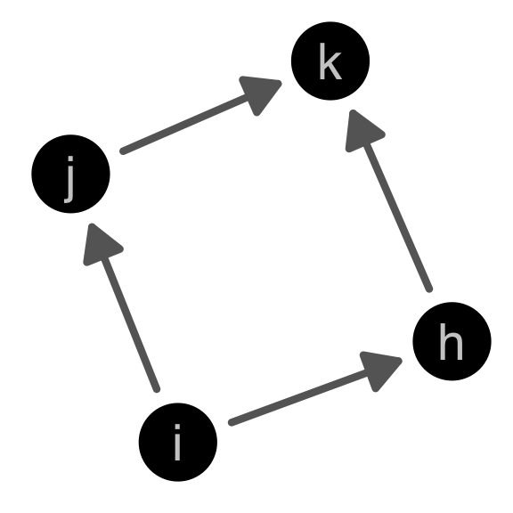

```{r setup, include=FALSE}
options(htmltools.dir.version = FALSE)
knitr::opts_chunk$set(echo = FALSE, tidy = TRUE, message = FALSE, warning = FALSE, dev = 'png', fig.width = 14, fig.height=9, fig.align='center', cache = TRUE)
```

```{r packages}
library(tidyverse)
library(geomnet)
library(RSiena)
library(lme4)
library(vinference)
```

```{r loaddata}
load("data/finalglmm31-2.RDA")
mod <- model2randomscalesize
turk22 <- read_csv("data/turk22-sig.csv")
```

# Updates

Publications: 

- **Tyner, S.**, Briatte, F. and Hofmann, H. "Network Visualization with ggplot2." *The R Journal*. 9:1, 27-54, URL: https://journal.r-project.org/archive/2017/RJ-2017-023/index.html  
--

- **Sam Tyner** (2016) "Using the R Package geomnet: Visualizing Trans-Atlantic
Slave Trade of Africans, 1514-1866," *CHANCE*, 29:3, 4-16, DOI: 10.1080/09332480.2016.1234879

---

# Updates

Post-graduation plans:

- Become a post-doctoral researcher in CSAFE at Iowa State working on human factors: 
    * Develop training materials for judges, lawyers, & practitioners 
    * Design and conduct mock jury studies
    * Open source, reproducible research in forensics
    
---

# Outline 

- Remaining results from MTurk Experiment
- Shiny app for creating lineups
- Shiny app for visual inference experiment
- Model Visualization for SAOMs
    * Model-in-data-space vs. Data-in-model-space
    * Collections of models
    * Exploring algorithms 
- Developing animations: *netvizinf* package 

---
class: inverse, center, middle

# Results (continued)

---

# Significance tests

- $p$-values calculated using the *vinference* package (Hofmann and Röttger, 2016)

```{r sigres, results='asis'}
turk22_sig <- turk22 %>% 
  mutate(type2 = ifelse(sign == 0, sign(initialEst), sign),
         type2 = ifelse(type == "one", type2, -1)) %>% 
  filter(param_value == 1)
summ_sig <- turk22_sig %>% group_by(pic_id, test_param) %>% 
  summarize(npick = sum(datapick), n = n(), 
            pv = map2_dbl(npick, n, pV, m=6, scenario=3))
names(summ_sig) <- c("Lineup ID", "parameter", "# Alt. Model Picks", "Total Views", "p-value")
summ_sig$parameter <- as.factor(summ_sig$parameter)
levels(summ_sig$parameter) <- paste0("&beta;<sub>", c(3,4), "</sub>")
knitr::kable(summ_sig, format = "markdown", digits = c(0,0,0,0,5))
```

---
class: plotslide

# Significance tests - $\beta_3$, rep. 1

- 4/29 chose alternative data plot (#2)

```{r sigjttp1}
dat <- read_csv("data/jttp_pos_hard_1.csv")
ggplot(data = dat) + 
        geom_net(aes(from_id = from, to_id = to), 
                 arrow = arrow(type = 'open', length = unit(2, "points") ), 
                 linewidth = .25, singletons = T, fiteach = T, directed = T, 
                 color = 'black', arrowgap = .015, arrowsize = .3, size =1) + 
        theme_net() + 
        theme(panel.background = element_rect(color = 'black'),
              strip.text = element_text(size = 20)) +
        facet_wrap(~ord)
```

---
class: plotslide

# Significance tests - $\beta_3$, rep. 2

- 26/31 chose alternative data plot (#3)

```{r sigjttp2}
dat <- read_csv("data/jttp_pos_hard_2.csv")
ggplot(data = dat) + 
        geom_net(aes(from_id = from, to_id = to), 
                 arrow = arrow(type = 'open', length = unit(2, "points") ), 
                 linewidth = .25, singletons = T, fiteach = T, directed = T, 
                 color = 'black', arrowgap = .015, arrowsize = .3, size =1) + 
        theme_net() + 
        theme(panel.background = element_rect(color = 'black'),
              strip.text = element_text(size = 20)) +
        facet_wrap(~ord)
```

---
class: plotslide

# Significance tests - $\beta_3$, rep. 3

- 2/27 chose alternative data plot (#1)

```{r sigjttp3}
dat <- read_csv("data/jttp_pos_hard_3.csv")
ggplot(data = dat) + 
        geom_net(aes(from_id = from, to_id = to), 
                 arrow = arrow(type = 'open', length = unit(2, "points") ), 
                 linewidth = .25, singletons = T, fiteach = T, directed = T, 
                 color = 'black', arrowgap = .015, arrowsize = .3, size =1) + 
        theme_net() + 
        theme(panel.background = element_rect(color = 'black'),
              strip.text = element_text(size = 20)) +
        facet_wrap(~ord)
```

---
class: plotslide

# Significance tests - $\beta_4$, rep. 1

- 10/23 chose alternative data plot (#5)

```{r sigjtts1}
dat <- read_csv("data/jtts_pos_hard_1.csv")
ggplot(data = dat) + 
        geom_net(aes(from_id = from, to_id = to), 
                 arrow = arrow(type = 'open', length = unit(2, "points") ), 
                 linewidth = .25, singletons = T, fiteach = T, directed = T, 
                 color = 'black', arrowgap = .015, arrowsize = .3, size =1) + 
        theme_net() + 
        theme(panel.background = element_rect(color = 'black'),
              strip.text = element_text(size = 20)) +
        facet_wrap(~ord)
```

---
class: plotslide

# Significance tests - $\beta_4$, rep. 2

- 3/37 chose alternative data plot (#1)

```{r sigjtts2}
dat <- read_csv("data/jtts_pos_hard_2.csv")
ggplot(data = dat) + 
        geom_net(aes(from_id = from, to_id = to), 
                 arrow = arrow(type = 'open', length = unit(2, "points") ), 
                 linewidth = .25, singletons = T, fiteach = T, directed = T, 
                 color = 'black', arrowgap = .015, arrowsize = .3, size =1) + 
        theme_net() + 
        theme(panel.background = element_rect(color = 'black'),
              strip.text = element_text(size = 20)) +
        facet_wrap(~ord)
```

---
class: plotslide

# Significance tests - $\beta_4$, rep. 3

- 10/29 chose alternative data plot (#2)

```{r sigjtts3}
dat <- read_csv("data/jtts_pos_hard_3.csv")
ggplot(data = dat) + 
        geom_net(aes(from_id = from, to_id = to), 
                 arrow = arrow(type = 'open', length = unit(2, "points") ), 
                 linewidth = .25, singletons = T, fiteach = T, directed = T, 
                 color = 'black', arrowgap = .015, arrowsize = .3, size =1) + 
        theme_net() + 
        theme(panel.background = element_rect(color = 'black'),
              strip.text = element_text(size = 20)) +
        facet_wrap(~ord)
```

---

# Goodness-of-fit tests

- $p$-values calculated using the *vinference* package (Hofmann and Röttger, 2016)

```{r gof, results='asis'}
turk22_gof <- read_csv("data/turk22-gof.csv")
turk22_gof_stats <- turk22_gof %>% group_by(pic_id) %>% 
  summarize(npickdata = sum(datapick), total = n(), 
          pvinf = map2_dbl(npickdata, total, pV, m = 6, scenario = 3))
turk22_gof_stats %>% separate(pic_id, into = c("discard", "model", "rep"), sep = c(2,3)) -> print_gof_stats
print_gof_stats %>% select(-discard) %>% mutate(model = paste0("M", (as.integer(model))))-> print_gof_stats
names(print_gof_stats) <- c("Model", "Replicate", "Data Picks", "Total Viewers", "p-value")
print_gof_stats$`p-value` <- ifelse(print_gof_stats$`p-value` < .0001, "< 0.0001", as.character(round(print_gof_stats$`p-value`,4)))
knitr::kable(print_gof_stats, format="markdown", digits = 4, align = c("l", "c", "c", "c", "r"))
```

---
class: plotslide

# Goodness-of-fit test: M3, rep 1

- 29/36 selected the data

```{r gofm31}
load("data/se112adjmat.RDS")
wave2 <- data.frame(se112adj)
senators <- data.frame(id = colnames(wave2), number = 1:155)
wave2$from <- colnames(wave2)
wave2 <- wave2 %>% gather(to, val, Alan.Stuart.Franken:William.Cowan) %>% filter(val > 0)
wave2 <- merge(wave2, senators, by.x = "from", by.y = "id", all = T)
wave2$from <- senators$number[match(wave2$from, senators$id)]
wave2$to <- senators$number[match(wave2$to, senators$id)]
wave2$from <- paste0("V", wave2$from)
wave2$to <- ifelse(is.na(wave2$to), NA, paste0("V", wave2$to))
wave2 <- wave2 %>% mutate(sim = 1001, model = "data", wave = 1) %>% select(-c(val, number))
dat <- read_csv(paste0("data/jttp_gof_9_1.csv"))
datplot <- unique(dat$ord[dat$sim == 1001])
dat <- dat %>% filter(sim != 1001) %>% 
      bind_rows(wave2) %>% 
      mutate(ord = ifelse(is.na(ord), datplot, ord))
ggplot(data = dat) + 
        geom_net(aes(from_id = from, to_id = to), 
                 arrow = arrow(type = 'open', length = unit(2, "points") ), 
                 linewidth = .25, singletons = T, fiteach = T, directed = T, 
                 color = 'black', arrowgap = .015, arrowsize = .3, size =1) + 
        theme_net() + 
        theme(panel.background = element_rect(color = 'black'),
              strip.text = element_text(size = 20)) +
        facet_wrap(~ord)
```

---
class: plotslide

# Goodness-of-fit test: M4, rep 2

- 7/20 selected the data 

```{r}
dat <- read_csv(paste0("data/jtts_gof_9_2.csv"))
datplot <- unique(dat$ord[dat$sim == 1001])
dat <- dat %>% filter(sim != 1001) %>% 
      bind_rows(wave2) %>% 
      mutate(ord = ifelse(is.na(ord), datplot, ord))
ggplot(data = dat) + 
        geom_net(aes(from_id = from, to_id = to), 
                 arrow = arrow(type = 'open', length = unit(2, "points") ), 
                 linewidth = .25, singletons = T, fiteach = T, directed = T, 
                 color = 'black', arrowgap = .015, arrowsize = .3, size =1) + 
        theme_net() + 
        theme(panel.background = element_rect(color = 'black'),
              strip.text = element_text(size = 20)) +
        facet_wrap(~ord)
```

---
class: plotslide

# Goodness-of-fit test: M5, rep 3

- 14/16 selected the data 

```{r}
dat <- read_csv(paste0("data/simttb_gof_9_3.csv"))
datplot <- unique(dat$ord[dat$sim == 1001])
dat <- dat %>% filter(sim != 1001) %>% 
      bind_rows(wave2) %>% 
      mutate(ord = ifelse(is.na(ord), datplot, ord))
ggplot(data = dat) + 
        geom_net(aes(from_id = from, to_id = to), 
                 arrow = arrow(type = 'open', length = unit(2, "points") ), 
                 linewidth = .25, singletons = T, fiteach = T, directed = T, 
                 color = 'black', arrowgap = .015, arrowsize = .3, size =1) + 
        theme_net() + 
        theme(panel.background = element_rect(color = 'black'),
              strip.text = element_text(size = 20)) +
        facet_wrap(~ord)
```

---
class: plotslide

# Goodness-of-fit test: M7, rep 1

- 17/20 selected the data 

```{r}
dat <- read_csv(paste0("data/bigmod_gof_9_1.csv"))
datplot <- unique(dat$ord[dat$sim == 1001])
dat <- dat %>% filter(sim != 1001) %>% 
      bind_rows(wave2) %>% 
      mutate(ord = ifelse(is.na(ord), datplot, ord))
ggplot(data = dat) + 
        geom_net(aes(from_id = from, to_id = to), 
                 arrow = arrow(type = 'open', length = unit(2, "points") ), 
                 linewidth = .25, singletons = T, fiteach = T, directed = T, 
                 color = 'black', arrowgap = .015, arrowsize = .3, size =1) + 
        theme_net() + 
        theme(panel.background = element_rect(color = 'black'),
              strip.text = element_text(size = 20)) +
        facet_wrap(~ord)
```

---
class: inverse, center, middle

# App for creating lineups

---

# Screen grab


---
class: inverse, center, middle

# Shiny app for visual inference experiment

---
class: inverse, center, middle

# Model Visualization for SAOMs

---
class: definition

# Model visualization 

## Model visualization summarizes the model with graphical, as opposed to numerical summaries to answer questions such as

1. What does the model look like? 
2. How does the model change when its parameters change? How do the parameters change when the data is changed?
3. How well does the model fit the data? How does the shape of the model compare to the shape of the data? 
4. Is the model fitting uniformly good, or good in some regions but poor in other regions? Where might the fit be improved?

(questions from Wickham et al 2015)

---

# How? 

Three main approaches: 

- View the model in the data-space
- View collections of models
- Exploring algorithms 

---

# The Data

- Subset of Michell and Amos (1997)


---
class: math

# The Models 

SAOMs with rate parameter $\alpha_m$ and different objective functions:

- Model M1: $f_{i}(x, \boldsymbol{\beta}) = \beta_1 s_{i1}(x) + \beta_2 s_{i2}(x)$
- Model M2: $f_i(x, \boldsymbol{\beta}, \mathbf{z}) = \beta_1 s_{i1}(x) + \beta_2 s_{i2}(x) + \beta_3s_{i3}(x, \mathbf{z})$
- Model M3: $f_i(x) = \beta_1 s_{i1}(x) + \beta_2 s_{i2}(x) + \beta_7s_{i7}(x)$ 

---
class: center

# $\beta_7$

$$s_{i7}(x) = |\{k : x_{ik} = 0, \sum\limits_h x_{ih}x_{hk} \geq 2\}|$$



---
class: inverse, center, middle

# Model-vis Principle #1: Model in Data Space

---
class: definition 

# Model in the data space

## "Visualizing the model in the context of the data [by] displaying the model in the high-dimensional data space" (Wickham et al., 2015)

---
class: definition

# Data in the model space

## Visualizing the data in a "low-dimensional space generated by the model" (Wickham et al., 2015)

---

# What do m-in-ds and d-in-ms mean for network data? 

Three data spaces for dynamic network data

1. The actors and their covariates
2. The edges and their variables describing the ties between the nodes
3. The time, both the continuous unobserved time and the discrete observed time points, over which the network evolves

---

# Combining the three data spaces

- Node-link visualization to combine node and edge data spaces 
- Side-by-side node-link diagrams for capturing the time data space

???
Node-link uses one of many algorithms to layout the actors as points in 2D space, then draws segments connecting the points in 2D if there is an edge between two nodes, and draws nothing otherwise.

---
class: plotslide

# Node-link diagram: m-in-ds

- Simulate wave 2 1,000 times from M1 
- Count number of times edges occur
- Create "average" network 


---

class: plotslide

# Goodness of fit: d-in-ms

- Data outdegree counts among the same simulations from M1


---
class: majorpoint

# M-in-DS vs. D-in-MS

- data in model space approach: model appears to be a good fit
- model in data space approach: model appears to be a poor fit

---
class: inverse, middle, center

# Model-vis Principle #2: View collections of models

---

# Explore the space of all possible models


---

# Vary model settings


---

# Fit same model form to different data


---

# Fit one model to same data many times


---
class: inverse, middle, center

# Model-vis Principle #3: Exploring algorithms

---
class: plotslide

# Displaying underlying CTMC: Node-link

<iframe src="https://player.vimeo.com/video/240089108" width="640" height="550" frameborder="0" webkitallowfullscreen mozallowfullscreen allowfullscreen></iframe> <p><a href="https://vimeo.com/240089108">SAOM Microstep Node-Link Animation</a> from <a href="https://vimeo.com/sctyner">Sam Tyner</a> on <a href="https://vimeo.com">Vimeo</a>.</p>

---
class: plotslide

# Displaying underlying CTMC: Adjacency matrix

<iframe src="https://player.vimeo.com/video/240092677" width="640" height="500" frameborder="0" webkitallowfullscreen mozallowfullscreen allowfullscreen></iframe> <p><a href="https://vimeo.com/240092677">SAOM Microstep Adjacency Matrix Animation</a> from <a href="https://vimeo.com/sctyner">Sam Tyner</a> on <a href="https://vimeo.com">Vimeo</a>.</p>

---
class: plotslide

# Displaying many CTMCs


---

# Developing animations: *netvizinf* package 


---

# References

Hofmann, H. and Röttger, C. (2016). vinference: Inference under the lineup protocol. R package version 0.1.1. http://github.com/heike/vinference
  
Michell, L. and Amos, A. (1997). Girls, pecking order and smoking. Social Science & Medicine, 44(12):1861–1869.

Wickham, H., Cook, D., and Hofmann, H. (2015). Visualizing statistical models: Removing the blindfold. Statistical Analysis and Data Mining, 8(4):203–225.