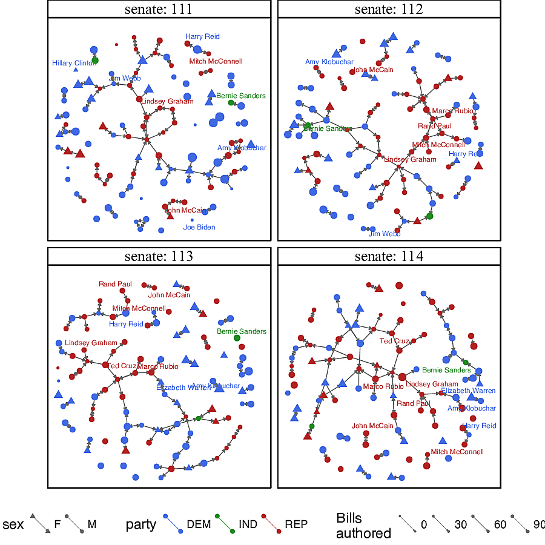
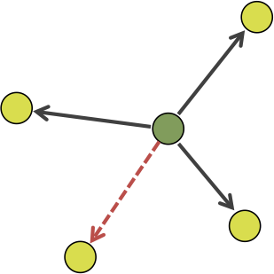
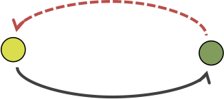
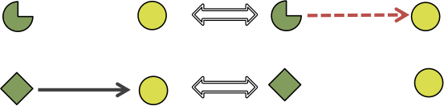
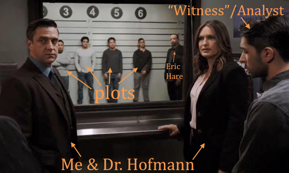
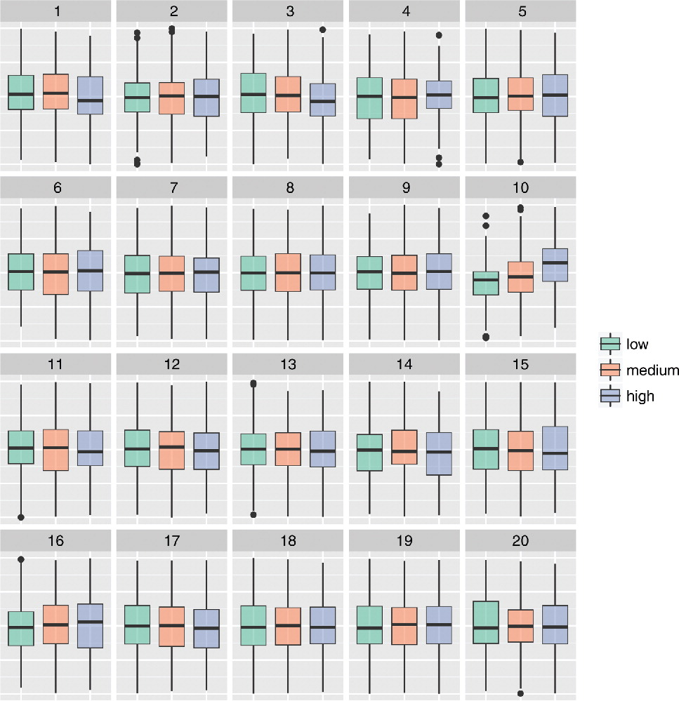
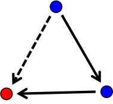
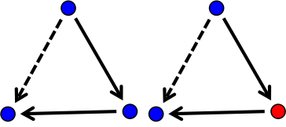
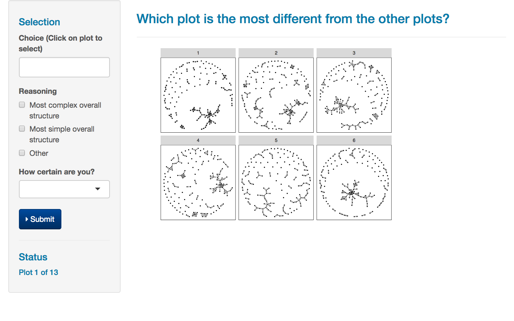

```{r setup, include=FALSE}
options(htmltools.dir.version = FALSE)
knitr::opts_chunk$set(echo = FALSE, tidy = TRUE, message = FALSE, warning = FALSE, dev = 'png')
```

```{r packages}
library(tidyverse)
library(geomnet)
library(RSiena)
library(lme4)
```

```{r loaddata}
load("data/finalglmm31-2.RDA")
mod <- model2randomscalesize
turk22 <- read_csv("data/turk22-sig.csv")
```

# Outline 

- A social network example 
--

- What is a SAOM?
--

- Questions of interest
--

- Example visualizations
--

- What is the lineup protocol?
--

- Design of experiment
--

- Data collection 
--

- A GLMMer of hope
--

- Results
--

- Conclusions and future directions


---
class: inverse, center, middle 

# A social network example


---
class: plotslide, center

# Senate collaboration in the Obama years



???
- Collaboration in the US Congress: cosponsorship of legislation. 
- Bills have one primary author, and many senators can cosponsor a bill as an indication of their support for it.
- Edges are directed and binary: edge from senator A to senator B is drawn if senator A frequently cosponsors the legislation that senator B authored. (Skip exact definition of WPC) 
- e.g. 114th senate (bottom right corner), there is an edge from Harry Ried to Mitch McConnell: Ried frequently cosponsored McConnell's legislation but not the other way around. 
- A model for this data = two main things to consider
1. dynamic networks - 4 senate sessions in 8 years, observed at the end
2. nodes (senators) - their characteristics (party) will affect the edges in the network
- We model these data with stochastic actor-oriented models

---
class: inverse, center, middle

# What is a SAOM?

---
class: definition

# Stochastic Actor-Oriented Model (SAOM)

## A statistical model applied to *dynamic* social networks which takes both the *network structure* and the *node-level covariates* into account

First developed by Snijders (1996)

???
These models stand out from the pack because of their ability to incorporate non-structural information and their ability to model network change in time. Most traditional models only consider one observation at a time, and only consider network statistics, not other information that may affect change. 

---

# How? 

???
Everything is modeled at the actor-level
The actors are assumed to be conditionally independent given their current set of ties. Then, actors are individually "chosen" to make a tie change in continuous time. When an actor is chosen to change, it attempts to maximize its objective function by changing its relationship to other nodes. 
--

- Assume *conditional independence* of actors / nodes 
--

- Model the unobserved tie changes one-at-a-time in a *continuous time Markov Chain*, which is broken into 2 parts: 
--

- Estimate the *rate* at which actors make changes in the network $$\alpha_m$$
--

- Maximize an actor's *objective function* when it makes a change $$f_{i}(x, \boldsymbol{\beta}, \mathbf{Z})$$
<!-- Do I talk about CTMCs? -->

???
The actors are assumed to be conditionally independent given their current set of ties. Then, actors are individually "chosen" to make a tie change in continuous time. When an actor is chosen to change, it attempts to maximize its objective function by changing its relationship to other nodes. 

---
class: math

# Basic Notation 

$x$ - the current network state in the model

$x(t_1), \dots, x(t_M)$ - the observed network at the discrete time points $t_1, \dots, t_M$ 

$x_{ij}$ - the binary tie variable from actor $i$ to actor $j$, $i,j \in \{1, \dots, n = \text{# of actors}\}$

$x(i \leadsto j)$ - the network that only differs from $x$ by one tie, $x_{ij}$ 

$\alpha_m$ - the rate parameter for the period from $t_{m-1}$ to $t_m$

$\mathbf{Z}$ - an $n \times p$ matrix of $p$ actor-level covariates of interest

$\boldsymbol{\beta}$ - a $K \times 1$, $K>p$, vector of parameters in the objective function

$s_{ik}(x, \mathbf{Z})$ - a statistic computed for actor $i$ and parameter $k$ in the objective function

---
class: math 

# Rate parameter

- In period $m$, the waiting time $\tau_i$ until actor $i$'s next opportunity for change: $$\tau_i | x_{i1}, \dots, x_{in}\stackrel{iid}{\sim} Exp(\alpha_m)$$
- Expected value is $\alpha_m^{-1}$
- In period $m$, the waiting time $\tau$ until any actor gets to change: $$\tau(x|m) \sim  Exp(n\alpha_m)$$
- Expected value is $(n\alpha_m)^{-1}$

---
class: math

# Objective Function

Actor $i$ gets the opportunity to change, and attempts to maximize its *objective function*:
$$f_{i}(x, \boldsymbol{\beta}, \mathbf{Z}) = \sum_{k=1}^K \beta_{k} s_{ik}(x,\mathbf{Z}) + U$$
where $U$ is a random component encompassing all other reasons for change not in the objective function

---
class: math

# Some objective function parameters 

At minimum 2 parameters in the objective function (Ripley et al. 2017): 

| Name | Parameter | Statistic | Picture |
|:-----|:---------:|:---------:|:--------:|
| density | $\beta_1$ | $s_{i1}(x) = \sum_j x_{ij}$|  |
| reciprocity | $\beta_2$ | $s_{i2}(x) = \sum_j x_{ij}x_{ji}$|  |
<!--| covariate-alter | $\beta_3$ | $\sum_j x_{ij}z_j$ | |
| covariate-ego  | $\beta_5$ | $z_i\sum_j x_{ij}$ | |-->

```{r densrecipex, fig.height=5, fig.show='hold', out.width = '49%'}
densex <- read_csv("data/highdensityex.csv")
recipex <- read_csv("data/highrecipex.csv")

ggplot(data = densex %>% filter(ord == 1)) + 
  geom_net(aes(from_id = from, to_id = to), 
                 arrow = arrow(type = 'open', length = unit(2, "points") ), 
                 linewidth = .25, singletons = T, fiteach = T, directed = T, 
                 color = 'black', arrowgap = .015, arrowsize = .3, size =1) + 
        theme_net() +  
  labs(title = expression(paste("High value of " , beta[1]))) + 
  theme(plot.title = element_text(size = 20))

ggplot(data = densex %>% filter(ord == 6)) + 
  geom_net(aes(from_id = from, to_id = to), 
                 arrow = arrow(type = 'open', length = unit(2, "points") ), 
                 linewidth = .25, singletons = T, fiteach = T, directed = T, 
                 color = 'black', arrowgap = .015, arrowsize = .3, size =1) + 
        theme_net() +  
  labs(title = expression(paste("Low value of " , beta[1]))) + 
  theme(plot.title = element_text(size = 20))

  
```


???
- Higher density parameter increases number of outgoing ties, making the network more dense
- Higher reciprocity parameter increases the number of reciprocated ties, making the network more connected 
- Many possible parameters to include in the objective function. 
- Depends on subject area knowledge of the researcher to include the "right" parameters. 
- More later 

<!--
---
class: math 

# Transition Probability

- Actor $i$ given chance to change
- What is probability the tie $x_{ij}$ changes?

$$p_{ij} = \frac{\exp\{f_{i}(x(i \leadsto j), \boldsymbol{\beta}, \mathbf{Z})\}}{\sum_{h=1}^n \exp\{f_{i}(x(i \leadsto h), \boldsymbol{\beta}, \mathbf{Z})\}}$$
- Used in estimation and simulation

<!--??? Gloss over
-->

---
class: inverse, center, middle

# Questions of interest

---
class: majorpoint

# What don't we know?

- Which parameters should we include in the model? 
???
- There are dozens of possible parameters. How can we possibly pick which ones to include?
--

- How do we interpret these parameters? 
???
- If the estimated value of beta 2 is 5, what does that mean about our data? What about if it's negative 5? 
--

- How do we know if the model we chose for our data is a "good" model? 
???
- What goodness of fit measures can we look at? 
- We answer these question using data visualization, visual inference, and the lineup protocol. 

---
class: inverse, center, middle

# Example visualizations

---
class: plotslide, center

# What do you think? Are these two networks from the same model?

```{r compare1, fig.width=12.2, fig.height=8}
library(tidyverse)
library(geomnet)
dat <- read_csv("data/jttp_pos_easy_1.csv")
ggplot(data = dat %>% filter(ord %in% 1:2)) + 
        geom_net(aes(from_id = from, to_id = to), 
                 arrow = arrow(type = 'open', length = unit(2, "points") ), 
                 linewidth = .5, singletons = T, fiteach = T, directed = T, 
                 color = 'black', arrowgap = .015, arrowsize = .3, size =1) + 
        theme_net() + 
        theme(panel.background = element_rect(color = 'black'),
              strip.text = element_text(size = 20)) +
        facet_wrap(~ord)
```

---
class: plotslide, center

# What about these? Are these two networks from the same model?

```{r compare2, fig.width=12.2, fig.height=8}
ggplot(data = dat %>% filter(ord %in% 3:4)) + 
        geom_net(aes(from_id = from, to_id = to), 
                 arrow = arrow(type = 'open', length = unit(2, "points") ), 
                 linewidth = .25, singletons = T, fiteach = T, directed = T, 
                 color = 'black', arrowgap = .015, arrowsize = .3, size =1) + 
        theme_net() + 
        theme(panel.background = element_rect(color = 'black'),
              strip.text = element_text(size = 20)) +
        facet_wrap(~ord)
```

---
class: plotslide, center

# How about these? Are these two networks from the same model?

```{r compare3, fig.width=12.2, fig.height=8}
ggplot(data = dat %>% filter(ord %in% 5:6)) + 
        geom_net(aes(from_id = from, to_id = to), 
                 arrow = arrow(type = 'open', length = unit(2, "points") ), 
                 linewidth = .25, singletons = T, fiteach = T, directed = T, 
                 color = 'black', arrowgap = .015, arrowsize = .3, size =1) + 
        theme_net() + 
        theme(panel.background = element_rect(color = 'black'),
              strip.text = element_text(size = 20)) +
        facet_wrap(~ord)
```

---
class: plotslide

# Combined

```{r lineup3, fig.width=12.2, fig.height=8}
ggplot(data = dat) + 
        geom_net(aes(from_id = from, to_id = to), 
                 arrow = arrow(type = 'open', length = unit(2, "points") ), 
                 linewidth = .25, singletons = T, fiteach = T, directed = T, 
                 color = 'black', arrowgap = .015, arrowsize = .3, size =1) + 
        theme_net() + 
        theme(panel.background = element_rect(color = 'black'), strip.text = element_text(size = 20)) +
        facet_wrap(~ord)
```

???
Plots 1,2,3,5,6 were all simulated from the same model, while plot 4 was simulated from a model with one additional parameter in the objective function. 
This is an example of a lineup in our study. People picked 6 the most, then 4, then 5.

---
class: inverse, center, middle

# What is the lineup protocol?

---

# Lineup Idea



([Image Source](https://allthingslawandorder.blogspot.com/2017/05/law-order-svu-american-dream-sanctuary.html))
---
class: majorpoint

# Lineup protocol

- Have some data of interest and a visualization of that data
- Have a null hypothesis that the data come from a "null model"
- Simulate "null data" sets from the null model 
- Use the simulated data to create "null plots"
- Can you see the data plot among the null plots?
- Picking the data out among the nulls is evidence *against* the null model

---
class: definition

# Lineup

## The lineup "asks the witness to *identify* the plot of the *real data* from among a set of decoys, the null plots, under the veil of ignorance" (Buja et al. 2009, p. 4369)

---
class: plotslide, center

# From Loy et al. (2017)



---
class: plotslide, center

# From our lineup experiment

```{r lineup1, fig.width=12.2, fig.height=8}
ggplot(data = dat) + 
        geom_net(aes(from_id = from, to_id = to), 
                 arrow = arrow(type = 'open', length = unit(2, "points") ), 
                 linewidth = .25, singletons = T, fiteach = T, directed = T, 
                 color = 'black', arrowgap = .015, arrowsize = .3, size =1) + 
        theme_net() + 
        theme(panel.background = element_rect(color = 'black'),
              strip.text = element_text(size = 20)) +
        facet_wrap(~ord)
```

???
Show a bunch of lineups to a bunch of people to see what network structures they pick up on

---
class: inverse, center, middle

# Design of experiment

---

# Experiment idea

- Pick several SAOMs, varying parameters in the objective function that we think are important to SAOMs
--

- Fit models to the Senate collaboration data to get estimates of $\boldsymbol{\beta}$
--

- Simulate network data from the models using the estimates, and place the plots of the data in various lineup configurations to determine:
--

    * Which parameters are significant? 
    * Which models are good fits?
    * Which parameters are noticeable and at what values? 

---
class: math

# Parameters of interest 

| Name | Parameter | Statistic | Picture |
|:-----|:---------:|:---------:|:--------:|
| jumping transitive triplet - party (jttp)| $\beta_3$ | $s_{i3}(x, \mathbf{p}) = \sum_{j\neq h} x_{ij}x_{ih}x_{hj}\cdot \mathbb{I}(p_i = p_h \neq p_j)$ | |
| jumping transitive triplet - sex (jtts) | $\beta_4$ | $s_{i4}(x, \mathbf{s}) = \sum_{j\neq h} x_{ij}x_{ih}x_{hj}\cdot \mathbb{I}(s_i = s_h \neq s_j)$ | |
| similarity transitive triplet - bills (simttb) | $\beta_5$ | $s_{i5}(x, \mathbf{b}) = \sum_{j} x_{ij}x_{ih}x_{hj}\cdot (sim^b_{ij} - \overline{sim}^b)^*$ | |
| same transitive triplet - party (samettp) | $\beta_6$ | $s_{i6}(x, \mathbf{p}) =\sum_{j} x_{ij}x_{ih}x_{hj}\cdot \mathbb{I}(p_i = p_j)$ | |

$*-sim^b_{ij} = \frac{\max_{hk}|b_h - b_k| - |b_i - b_j|}{\max_{hk}|b_h - b_k|}$

???
In addition to the two basic structural parameters, density and reciprocity, we examine four additional covariate parameters. We selected these parameters because they were highly significant according to the traditional Wald-type tests built into the RSiena software. 

---
class: math

# Models for testing

- Model M1: $$f_{i}(x, \boldsymbol{\beta}) = \beta_1 s_{i1}(x) + \beta_2 s_{i2}(x)$$
- $\hat{\beta_1} = -4.903$, $\hat{\beta_2} = 4.893$

```{r m1, fig.height=5.5, fig.align='center', fig.width=9}
ggplot(data = dat %>% filter(ord %in% 1:3)) + 
        geom_net(aes(from_id = from, to_id = to), 
                 arrow = arrow(type = 'open', length = unit(2, "points") ), 
                 linewidth = .25, singletons = T, fiteach = T, directed = T, 
                 color = 'black', arrowgap = .015, arrowsize = .3, size =1) + 
        theme_net() + 
        theme(panel.background = element_rect(color = 'black'),
              strip.text = element_text(size = 20)) +
        facet_wrap(~ord)
```

---
class: math

# Models for testing

- Model M3: $$f_{i}(x, \boldsymbol{\beta}, \mathbf{p}) = \beta_1 s_{i1}(x) + \beta_2 s_{i2}(x) + \beta_3 s_{i3}(x, \mathbf{p})$$
- $\hat{\beta_1} = -4.902$, $\hat{\beta_2} = 4.893$, $\hat{\beta_3} = -3.450$ 

```{r jttpex, out.width='33%', fig.show='hold', fig.height=8}
# easy positive 10.350
jttp1 <- read_csv("data/jttp_neg_med_1.csv") %>% filter(sim == -1)
# med negative -10.35
jttp2 <- read_csv("data/jttp_pos_easy_1.csv") %>% filter(sim == -1)
# fitted val
jttp3 <- read_csv("data/jttp_pos_hard_1.csv") %>% filter(sim == -1)
ggplot(data = jttp1) + 
        geom_net(aes(from_id = from, to_id = to), 
                 arrow = arrow(type = 'open', length = unit(2, "points") ), 
                 linewidth = .25, singletons = T, fiteach = T, directed = T, 
                 color = 'black', arrowgap = .015, arrowsize = .3, size =1) + 
        theme_net() + 
  labs(title = expression(paste(beta[3], "= 10.35"))) + 
  theme(plot.title = element_text(size = 40))

ggplot(data = jttp2) + 
        geom_net(aes(from_id = from, to_id = to), 
                 arrow = arrow(type = 'open', length = unit(2, "points") ), 
                 linewidth = .25, singletons = T, fiteach = T, directed = T, 
                 color = 'black', arrowgap = .015, arrowsize = .3, size =1) + 
        theme_net() + 
  labs(title = expression(paste(beta[3], "= -10.35"))) + 
    theme(plot.title = element_text(size = 40))

ggplot(data = jttp3) + 
        geom_net(aes(from_id = from, to_id = to), 
                 arrow = arrow(type = 'open', length = unit(2, "points") ), 
                 linewidth = .25, singletons = T, fiteach = T, directed = T, 
                 color = 'black', arrowgap = .015, arrowsize = .3, size =1) + 
        theme_net() + 
  labs(title = expression(paste(beta[3], "=", hat(beta)[3], "= -3.450" ))) + 
   theme(plot.title = element_text(size = 40))

```

---
class: math

# Models for testing

- Model M4:  $$f_{i}(x, \boldsymbol{\beta}, \mathbf{s}) = \beta_1 s_{i1}(x) + \beta_2 s_{i2}(x) + \beta_4 s_{i4}(x, \mathbf{s})$$
- $\hat{\beta_1} = -4.918$, $\hat{\beta_2} = 4.898$, $\hat{\beta_4} = 3.340$ 

```{r jttsex, out.width='33%', fig.show='hold', fig.height=8}
# easy positive 6.681
jtts1 <- read_csv("data/jtts_pos_easy_1.csv") %>% filter(sim == -1)
# med negative -6.681
jtts2 <- read_csv("data/jtts_negative_bad.csv") %>% filter(ord == 2)
# fitted val
jtts3 <- read_csv("data/jtts_pos_hard_1.csv") %>% filter(sim == -1)
ggplot(data = jtts1) + 
        geom_net(aes(from_id = from, to_id = to), 
                 arrow = arrow(type = 'open', length = unit(2, "points") ), 
                 linewidth = .25, singletons = T, fiteach = T, directed = T, 
                 color = 'black', arrowgap = .015, arrowsize = .3, size =1) + 
        theme_net() + 
  labs(title = expression(paste(beta[4], "= 6.681"))) + 
  theme(plot.title = element_text(size = 40))

ggplot(data = jtts2) + 
        geom_net(aes(from_id = from, to_id = to), 
                 arrow = arrow(type = 'open', length = unit(2, "points") ), 
                 linewidth = .25, singletons = T, fiteach = T, directed = T, 
                 color = 'black', arrowgap = .015, arrowsize = .3, size =1) + 
        theme_net() + 
  labs(title = expression(paste(beta[4], "= -6.681"))) + 
    theme(plot.title = element_text(size = 40))

ggplot(data = jtts3) + 
        geom_net(aes(from_id = from, to_id = to), 
                 arrow = arrow(type = 'open', length = unit(2, "points") ), 
                 linewidth = .25, singletons = T, fiteach = T, directed = T, 
                 color = 'black', arrowgap = .015, arrowsize = .3, size =1) + 
        theme_net() + 
  labs(title = expression(paste(beta[4], "=", hat(beta)[4], "= 3.340" ))) + 
   theme(plot.title = element_text(size = 40))
```

---
class: math

# Models for testing

- Model M5: $$f_{i}(x, \boldsymbol{\beta}, \mathbf{b}) = \beta_1 s_{i1}(x) + \beta_2 s_{i2}(x) + \beta_5 s_{i5}(x, \mathbf{b})$$
- $\hat{\beta_1} = -4.917$, $\hat{\beta_2} = 4.890$, $\hat{\beta_5} = 10.091$ 

```{r simttbex, out.width='33%', fig.show='hold', fig.height=8}
# easy positive 20.182
simttb1 <- read_csv("data/simttb_pos_easy_1.csv") %>% filter(sim == -1)
# med negative -20.182
simttb2 <- read_csv("data/simttb_neg_med_1.csv") %>% filter(sim == -1)
# fitted val
simttb3 <- read_csv("data/simttb_est_val.csv") %>% filter(sim == -1)
ggplot(data = simttb1) + 
        geom_net(aes(from_id = from, to_id = to), 
                 arrow = arrow(type = 'open', length = unit(2, "points") ), 
                 linewidth = .25, singletons = T, fiteach = T, directed = T, 
                 color = 'black', arrowgap = .015, arrowsize = .3, size =1) + 
        theme_net() + 
  labs(title = expression(paste(beta[5], "= 20.182"))) + 
  theme(plot.title = element_text(size = 40))

ggplot(data = simttb2) + 
        geom_net(aes(from_id = from, to_id = to), 
                 arrow = arrow(type = 'open', length = unit(2, "points") ), 
                 linewidth = .25, singletons = T, fiteach = T, directed = T, 
                 color = 'black', arrowgap = .015, arrowsize = .3, size =1) + 
        theme_net() + 
  labs(title = expression(paste(beta[5], "= -20.182"))) + 
    theme(plot.title = element_text(size = 40))

ggplot(data = simttb3) + 
        geom_net(aes(from_id = from, to_id = to), 
                 arrow = arrow(type = 'open', length = unit(2, "points") ), 
                 linewidth = .25, singletons = T, fiteach = T, directed = T, 
                 color = 'black', arrowgap = .015, arrowsize = .3, size =1) + 
        theme_net() + 
  labs(title = expression(paste(beta[5], "=", hat(beta)[5], "= 10.091" ))) + 
   theme(plot.title = element_text(size = 40))
```

---
class: math

# Models for testing

- Model M6: $$f_{i}(x, \boldsymbol{\beta}, \mathbf{p}) = \beta_1 s_{i1}(x) + \beta_2 s_{i2}(x) + \beta_6 s_{i6}(x, \mathbf{p})$$
- $\hat{\beta_1} = -4.911$, $\hat{\beta_2} = 4.881$, $\hat{\beta_6} = 1.329$ 

```{r samettpex, out.width='33%', fig.show='hold', fig.height=8}
# easy positive 5.316
samettp1 <- read_csv("data/samettp_pos_easy_1.csv") %>% filter(sim == -1)
# med negative -5.316
samettp2 <- read_csv("data/samettp-negative-bad.csv") %>% filter(sim == -1)
# fitted val
samettp3 <- read_csv("data/samettp_pos_hard_1.csv") %>% filter(sim == -1)
ggplot(data = samettp1) + 
        geom_net(aes(from_id = from, to_id = to), 
                 arrow = arrow(type = 'open', length = unit(2, "points") ), 
                 linewidth = .25, singletons = T, fiteach = T, directed = T, 
                 color = 'black', arrowgap = .015, arrowsize = .3, size =1) + 
        theme_net() + 
  labs(title = expression(paste(beta[6], "= 5.316"))) + 
  theme(plot.title = element_text(size = 40))

ggplot(data = samettp2) + 
        geom_net(aes(from_id = from, to_id = to), 
                 arrow = arrow(type = 'open', length = unit(2, "points") ), 
                 linewidth = .25, singletons = T, fiteach = T, directed = T, 
                 color = 'black', arrowgap = .015, arrowsize = .3, size =1) + 
        theme_net() + 
  labs(title = expression(paste(beta[6], "= -5.316"))) + 
    theme(plot.title = element_text(size = 40))

ggplot(data = samettp3) + 
        geom_net(aes(from_id = from, to_id = to), 
                 arrow = arrow(type = 'open', length = unit(2, "points") ), 
                 linewidth = .25, singletons = T, fiteach = T, directed = T, 
                 color = 'black', arrowgap = .015, arrowsize = .3, size =1) + 
        theme_net() + 
  labs(title = expression(paste(beta[6], "=", hat(beta)[6], "= 1.329" ))) + 
   theme(plot.title = element_text(size = 40))
```

---
class: math

# Models for testing

- Model M7: $$f_{i}(x, \boldsymbol{\beta}, \mathbf{p}, \mathbf{b}, \mathbf{s}) = \beta_1 s_{i1}(x) + \beta_2 s_{i2}(x) + \beta_4 s_{i4}(x, \mathbf{s}) + \beta_5 s_{i5}(x, \mathbf{b}) + \beta_6 s_{i6}(x, \mathbf{p})$$
- $\hat{\beta_1} = -4.923$, $\hat{\beta_2} = 4.892$, $\hat{\beta_4} = 2.374$ , $\hat{\beta_5} = 6.966$, $\hat{\beta_6} =0.205$ 
```{r bigmodex, fig.align='center', fig.height=6, fig.width=9 }
bigmod <- read_csv("data/bigmod_gof_9_1.csv")
ggplot(data = bigmod %>% filter(ord %in% 3:5)) + 
        geom_net(aes(from_id = from, to_id = to), 
                 arrow = arrow(type = 'open', length = unit(2, "points") ), 
                 linewidth = .25, singletons = T, fiteach = T, directed = T, 
                 color = 'black', arrowgap = .015, arrowsize = .3, size =1) + 
        theme_net() + 
  facet_wrap(~ord, nrow = 1) + 
  theme(strip.text = element_text(size = 20))
```

Estimates of $\beta_1, \dots, \beta_6$ calculated using the *RSiena* package by estimating models M1-M5 1,000 times and computing means. For model M6, 100 estimates were obtained (Ripley et al. 2017). Estimates are denoted $\hat{\beta}_1, \dots, \hat{\beta}_6$


---
class: majorpoint

# Hypotheses for significance test

For $k \in \{3, 4\}$

$H_0$: $\beta_k = 0$

$H_A$: $\beta_k \neq 0$

**Null model** for generating 5 null plots in the lineup: M1 ( $\beta_1 = \hat{\beta}_1, \beta_2 =\hat{\beta}_2$ )

**Alternative model** for generating 1 alternative plot in the lineup: 

- M3 ( $\beta_1 = \hat{\beta}_1, \beta_2 =\hat{\beta}_2, \beta_3 =\hat{\beta}_3$ ) or 
- M4 ( $\beta_1 = \hat{\beta}_1, \beta_2 =\hat{\beta}_2, \beta_4 =\hat{\beta}_4$ )

---
class: plotslide

# Significance test lineup example: M1 vs. M4

```{r fig.height=8, fig.width=12.2}
dat <- read_csv("data/jtts_pos_hard_1.csv")
ggplot(data = dat) + 
  geom_net(aes(from_id = from, to_id = to), 
                 arrow = arrow(type = 'open', length = unit(2, "points") ), 
                 linewidth = .25, singletons = T, fiteach = T, directed = T, 
                 color = 'black', arrowgap = .015, arrowsize = .3, size =1) + 
        theme_net() + 
        theme(panel.background = element_rect(color = 'black'), strip.text = element_text(size = 20)) +
        facet_wrap(~ord)
```

---
class: majorpoint

# Hypotheses for goodness-of-fit test

For $i$ in $\{3,4,6, 7\}$

$H_0$: Model M $i$ generated the network data

$H_A$: The network data do not come from the null model. 

**Null model** for generating 5 null plots in the lineup: 

- M3 ( $\beta_1 = \hat{\beta}_1, \beta_2 =\hat{\beta}_2, \beta_3 =\hat{\beta}_3$ ) or 
- M4  ( $\beta_1 = \hat{\beta}_1, \beta_2 =\hat{\beta}_2, \beta_4 =\hat{\beta}_4$ ) or 
- M5 ( $\beta_1 = \hat{\beta}_1, \beta_2 = \hat{\beta_2}, \beta_5 = \hat{\beta}_5$ ) or 
- M7 ( $\beta_1 = \hat{\beta}_1, \beta_2 =\hat{\beta}_2, \beta_4 =\hat{\beta}_4, \beta_5 =\hat{\beta}_5,\beta_6 =\hat{\beta}_6$ )

**Alternative model**: unknown, use the data as the alternative plot

---
class: plotslide

# Goodness-of-fit test lineup example: M7 vs. data

```{r fig.height=8, fig.width=12.2}
dat <- read_csv("data/bigmod_gof_9_1.csv")
ggplot(data = dat) + 
  geom_net(aes(from_id = from, to_id = to), 
                 arrow = arrow(type = 'open', length = unit(2, "points") ), 
                 linewidth = .25, singletons = T, fiteach = T, directed = T, 
                 color = 'black', arrowgap = .015, arrowsize = .3, size =1) + 
        theme_net() + 
        theme(panel.background = element_rect(color = 'black'), strip.text = element_text(size = 20)) +
        facet_wrap(~ord)
```

---
class: majorpoint

# Hypotheses for power

$H_0$: $\beta_k = 0$

$H_A$: $\beta_k \neq 0$

**Null model** for generating 5 null plots in the lineup: M1 ( $\beta_1 = \hat{\beta}_1, \beta_2 =\hat{\beta}_2$ )

**Alternative model** for generating 1 alternative plot in the lineup:

- M1 for 3 values of $\beta_1 < \hat{\beta}_1$ and 3 values of $\beta_1 > \hat{\beta}_1$
- M1 for 3 values of $\beta_2 < \hat{\beta}_2$ and 3 values of $\beta_2> \hat{\beta}_2$
- M3 for 3 values of $\beta_3 \leq \hat{\beta}_3$ and 3 values of $\beta_3 > \hat{\beta}_3$
- M4 for 3 values of $\beta_4 \geq \hat{\beta}_4$
- M5 for 3 values of $\beta_5 < \hat{\beta}_5$ and 3 values of $\beta_5 > \hat{\beta}_5$
- M6 for 3 values of $\beta_6 > \hat{\beta}_6$

---
class: plotslide

# Hypothesized power: additional parameter

```{r hyppower1, fig.height=8, fig.width=13, fig.align='center'}
x <- seq(-10, 10, .05)
N <- length(x)
qplot(x = 1:N, y = pt(x, 1), geom = 'line') + geom_line(aes(x = -(1:N), pt(x,1))) + 
  scale_x_continuous(name = "Parameter Value", labels = c("very negative", "negative", "0", "positive", "very positive")) + 
  #geom_hline(yintercept = 1/10, linetype = 'dotted') +
  geom_vline(xintercept = 0) + 
  geom_label(data = NULL, aes(x = 0, y = .9, label = "Null Model = Alt. Model"), size = 7) +
  #geom_vline(xintercept = 150, color = 'red', linetype = 'dotdash') + 
  #annotate('text', x = 160, y = .9, label = "hat(beta)",parse = TRUE) + 
  #geom_vline(xintercept = c(-300,-230, -175), color = c('green', 'yellow', 'red')) + 
  #geom_text(data = NULL, aes(x = -300, y = .75, label = "easy"), angle = 90, vjust = -.5) + 
  #  geom_text(data = NULL, aes(x = -230, y = .5, label = "medium"), angle = 90, vjust = -.5) +
  #  geom_text(data = NULL, aes(x = -175, y = .05, label = "hard"), angle = 90, vjust = -.5) + 
  scale_y_continuous(name = "% detecting plot from\nthe alternative model", labels = paste0(c(0,25,50,75,100), "%")) + 
  theme_bw() + 
  theme(text = element_text(size = rel(5)))
```

---
class: plotslide

# Hypothesized power: additional parameter

```{r hyppower2, fig.height=8, fig.width=13, fig.align='center'}
x <- seq(-10, 10, .05)
N <- length(x)
qplot(x = 1:N, y = pt(x, 1), geom = 'line') + geom_line(aes(x = -(1:N), pt(x,1))) + 
  scale_x_continuous(name = "Parameter Value", labels = c("very negative", "negative", "0", "positive", "very positive")) + 
  #geom_hline(yintercept = 1/10, linetype = 'dotted') +
  geom_vline(xintercept = 0) + 
  geom_label(data = NULL, aes(x = 0, y = .9, label = "Null Model = Alt. Model"), size = 7) +
  #geom_vline(xintercept = 150, color = 'red', linetype = 'dotdash') + 
  #annotate('text', x = 160, y = .9, label = "hat(beta)",parse = TRUE) + 
  geom_vline(xintercept = c(-300,-230, -175), color = c('green', 'yellow', 'red')) + 
  geom_text(data = NULL, aes(x = -300, y = .75, label = "easy"), angle = 90, vjust = -.5, size = 7) + 
  geom_text(data = NULL, aes(x = -230, y = .5, label = "medium"), angle = 90, vjust = -.5, size = 7) +
  geom_text(data = NULL, aes(x = -175, y = .05, label = "hard"), angle = 90, vjust = -.5, size = 7) + 
  scale_y_continuous(name = "% detecting plot from\nthe alternative model", labels = paste0(c(0,25,50,75,100), "%")) + 
  theme_bw() + 
  theme(text = element_text(size = rel(5)))
```

---
class: plotslide

# Hypothesized power: additional parameter

```{r hyppower3, fig.height=8, fig.width=13, fig.align='center'}
x <- seq(-10, 10, .05)
N <- length(x)
qplot(x = 1:N, y = pt(x, 1), geom = 'line') + geom_line(aes(x = -(1:N), pt(x,1))) + 
  scale_x_continuous(name = "Parameter Value", labels = c("very negative", "negative", "0", "positive", "very positive")) + 
  geom_hline(yintercept = 1/10, linetype = 'dotted') +
  geom_vline(xintercept = 0) + 
  geom_label(data = NULL, aes(x = 0, y = .9, label = "Null Model = Alt. Model"), size = 7) +
  geom_vline(xintercept = 150, color = 'red', linetype = 'dotdash') + 
  annotate('text', x = 160, y = .9, label = "hat(beta)",parse = TRUE, size = 8) + 
  geom_vline(xintercept = c(-300,-230, -175), color = c('green', 'yellow', 'red')) + 
  geom_text(data = NULL, aes(x = -300, y = .75, label = "easy"), angle = 90, vjust = -.5, size = 7) + 
  geom_text(data = NULL, aes(x = -230, y = .5, label = "medium"), angle = 90, vjust = -.5, size = 7) +
  geom_text(data = NULL, aes(x = -175, y = .05, label = "hard"), angle = 90, vjust = -.5, size = 7) + 
  scale_y_continuous(name = "% detecting plot from\nthe alternative model", labels = paste0(c(0,25,50,75,100), "%")) + 
  theme_bw() + 
  theme(text = element_text(size = rel(5)))
```

---
class: plotslide

# Hypothesized power: changing $\beta_1, \beta_2$ in M1

```{r hyppowerm1, fig.height=8, fig.width=13, fig.align='center'}
x <- seq(-10, 10, .05)
N <- length(x)
qplot(x = 1:N, y = pt(x, 1), geom = 'line') + geom_line(aes(x = -(1:N), pt(x,1))) + 
  scale_x_continuous(name = "Parameter Value", labels = c(expression(paste("much less than ", hat(beta))), expression(paste("less than ", hat(beta))), expression(hat(beta)), expression(paste("greater than ", hat(beta))), expression(paste("much greater than ", hat(beta))))) + 
  geom_hline(yintercept = 1/10, linetype = 'dotted') +
  geom_vline(xintercept = 0) + 
  geom_label(data = NULL, aes(x = 0, y = .9, label = "Null Model = Alt. Model"), size = 7) +
  geom_vline(xintercept = c(-300,-230, -175), color = c('green', 'yellow', 'red')) + 
  geom_text(data = NULL, aes(x = -300, y = .75, label = "easy"), angle = 90, vjust = -.5, size = 7) + 
  geom_text(data = NULL, aes(x = -230, y = .5, label = "medium"), angle = 90, vjust = -.5, size = 7) +
  geom_text(data = NULL, aes(x = -175, y = .05, label = "hard"), angle = 90, vjust = -.5, size = 7) + 
  scale_y_continuous(name = "% detecting plot from\nthe alternative model", labels = paste0(c(0,25,50,75,100), "%")) + 
  theme_bw() + 
  theme(text = element_text(size = rel(5)), 
        axis.text.x = element_text(angle = 30, size = rel(4),hjust = 1))
```

---
class: majorpoint

# Additional hypotheses

For M4 and M6, smaller values of $\beta_4$ and $\beta_6$ were unnoticeable.

Reversed the hypothesized models to test for symmetry: 

**Null model** for generating 5 null plots in the lineup: 

- M4 for 3 values of $\beta_4$ greater than $\hat{\beta}_4$
- M6 for 3 values of $\beta_6$ greater than $\hat{\beta}_6$

**Alternative model** for generating 1 alternative plot in lineup: M1 ( $\beta_1 = \hat{\beta}_1, \beta_2 =\hat{\beta}_2$ )

- Will the one instance of the simple model placed among several instances of the more complex model be noticed at the same rate of the one instance of the more complex model placed among severall null plots? 

---

# Summary of experimental conditions

```{r expertable, results='asis'}
modelData_sig <- turk22 %>% 
  mutate(type2 = ifelse(sign == 0, sign(initialEst), sign),
         type2 = ifelse(type == "one", type2, -1)) %>% 
  filter(pic_id != 3132) 
modelData_sig$centersize <- as.numeric(scale(modelData_sig$size))
sub <- attr(scale(modelData_sig$size), "scaled:center")
div <- attr(scale(modelData_sig$size), "scaled:scale")
modelData_sig %>% group_by(test_param, type2, difficulty, size) %>%
  count() %>% ungroup() %>%
  spread(difficulty, size) -> step1
step1 %>% select(1:4) %>% filter(!is.na(`1`)) -> step2a
step1 %>% select(c(1:3,5)) %>% filter(!is.na(`2`)) -> step2b
step1 %>% select(c(1:3,6)) %>% filter(!is.na(`3`)) -> step2c
experdet <- step2a %>% mutate(easy = `1`, medium = step2b$`2`, hard = step2c$`3`) %>% select(-c(`1`, n))
experdet$test_param <- as.factor(experdet$test_param)
levels(experdet$test_param) <- paste0("&beta;<sub>", c(1,3,4,2,6,5), "</sub>")
experdet$test_param <- as.character(experdet$test_param)
names(experdet) <- c("Parameter", "Condition", "Easy Value", "Medium Value", "Hard Value")
experdet <- arrange(experdet, Parameter, Condition)
# experdet$Parameter[c(2,4,6,8,10,12)] <- ""
# experdet$Parameter[1] <- expression(beta[1])
# experdet$Parameter[3] <-expression(beta[3])
# experdet$Parameter[5] <-expression(beta[5])
# experdet$Parameter[7] <-expression(beta[2])
# experdet$Parameter[9] <-expression(beta[6])
# experdet$Parameter[11] <-expression(beta[5])
experdet$Condition[c(7,11)] <- "reverse" 
knitr::kable(experdet, format = "markdown", digits = c(0,0,4,4,3), padding=0)
```

---
class: inverse, center, middle

# Data Collection

---

# App interface



---

# Amazon MTurk

- 250 participants recruited through Amazon Mechanical Turk 
- Each was presented the instructions and provided demographic information, two trial plots, and then 13 lineups to identify which plot was most different from the others
- Participants were paid $1.75

---
class: inverse, center, middle

# A GLMMer of hope

---
class: math

# Hierarchical model

Binary response variable $Y_{ijkm}$ indicating whether participant $m$ selected the alternative data plot in the $k^{th}$ repitition of a lineup of parameter $i$ and type $j$. 

$$Y_{ijkm} \sim \text{Bernoulli}(\pi_{ijkm})$$
$$\text{logit}(\pi_{ijkm}) = \alpha_{ij} + \beta_{ij} x + \delta_{ijk} + \epsilon_{m}$$
$$\delta_{ijk} \stackrel{iid}{\sim} N(0, \sigma^2_{\delta})$$
$$\epsilon_{m} \stackrel{iid}{\sim} N(0, \sigma^2_{\epsilon})$$ 

$x$ is the value of $\beta$, centered and scaled; $\delta_{ijk}$ is the random effect for lineup; $\epsilon_{m}$ is the random effect for viewer

???
This is the model we use for determining the visual power of the effect. We will predict the probability of detecting an effect at the given size when it is present in one of six plots in a lineup. 

---
class: math

# Predicting for new repitition, new observer

Expected value of link function:

$$E[\text{logit}(\pi_{ij})] = \alpha_{ij} + \beta_{ij} x$$

Expected value of probability

$$E[\pi_{ij}] = \frac{\exp\{\alpha_{ij} + \beta_{ij} x\}}{1 + \exp\{\alpha_{ij} + \beta_{ij} x\}}$$


---
class: inverse, center, middle

# Results

---

# Parameter estimates

$\hat{\sigma}_{\delta}^2 =$ `r round(summary(model2randomscalesize)[[13]]$pic_id[[1]], 4)`

$\hat{\sigma}_{\epsilon}^2 =$ `r round(summary(model2randomscalesize)[[13]]$nick_name[[1]], 4)`

9 of 12 $\alpha_{ij}$ were significant at 0.05

8 of 12 $\beta_{ij}$ were significant at 0.05

---
class: plotslide 

# Reminder: hypothesized power

```{r hyppowerrefresh, fig.height=8, fig.width=13, fig.align='center'}
x <- seq(-10, 10, .05)
N <- length(x)
qplot(x = 1:N, y = pt(x, 1), geom = 'line') + geom_line(aes(x = -(1:N), pt(x,1))) + 
  scale_x_continuous(name = "Parameter Value", labels = c("very negative", "negative", "0", "positive", "very positive")) + 
  geom_hline(yintercept = 1/10, linetype = 'dotted') +
  geom_vline(xintercept = 0) + 
  geom_label(data = NULL, aes(x = 0, y = .9, label = "Null Model = Alt. Model"), size = 7) +
  geom_vline(xintercept = 150, color = 'red', linetype = 'dotdash') + 
  annotate('text', x = 160, y = .9, label = "hat(beta)",parse = TRUE, size = 8) + 
  geom_vline(xintercept = c(-300,-230, -175), color = c('green', 'yellow', 'red')) + 
  geom_text(data = NULL, aes(x = -300, y = .75, label = "easy"), angle = 90, vjust = -.5, size = 7) + 
  geom_text(data = NULL, aes(x = -230, y = .5, label = "medium"), angle = 90, vjust = -.5, size = 7) +
  geom_text(data = NULL, aes(x = -175, y = .05, label = "hard"), angle = 90, vjust = -.5, size = 7) + 
  scale_y_continuous(name = "% detecting plot from\nthe alternative model", labels = paste0(c(0,25,50,75,100), "%")) + 
  theme_bw() + 
  theme(text = element_text(size = rel(5)))
```

---
class: plotslide

# Model Predictions: $\beta_1$
```{r modelests}
alphas <- (coef(mod)[[1]][,-1] %>% unique())[1:12] 
betas <- (coef(mod)[[1]][,-1] %>% unique())[13:24] 
names(betas) <- str_replace(str_replace(names(betas), "lps_param", ""), ":centersize", "")
names(betas) <- str_replace(names(betas), ".-1", "neg")
names(betas) <- str_replace(names(betas), ".1", "pos")
names(alphas) <- str_replace(names(alphas), "lps_param", "")
names(alphas) <- str_replace(names(alphas), ".-1", "neg")
names(alphas) <- str_replace(names(alphas), ".1", "pos")

```

- $\text{logit}(\pi_{1-1}) =$ `r round(alphas$densneg,3)` $+$ `r round(betas$densneg,3)` $x$    
- $\text{logit}(\pi_{11}) =$ `r round(alphas$denspos, 3)` $+$ `r round(betas$denspos, 4)` $x$    

```{r, fig.width = 14, fig.height=9, fig.align='center'}
source("code/newpredictions.R")
newdata <- newdata3
newdata$param <- newdata$test_param
newdata$param <- as.factor(newdata$test_param)
levels(newdata$param) <-  c(1,3,4,2,6,5) 
newdata$param <- as.integer(as.character(newdata$param))
plotdata <- turk22 %>% mutate(type2 = ifelse(sign == 0, sign(initialEst), sign),
                       type2 = ifelse(type == "one", type2, -1)) %>% 
  group_by(pic_id, size, test_param, sign, type2,alt_model) %>% summarize(
    datapick = mean(datapick)
)
plotdata$param <- plotdata$test_param
plotdata$param <- as.factor(plotdata$param)
levels(plotdata$param) <- c(1,3,4,2,6,5) 
plotdata$param <- as.integer(as.character(plotdata$param))
labdat <- data_frame(test_param = "jttp", param = 3, type2 = -1, x = -5, y = .9, label = "jttp_neg_hard_2")

ggplot() + 
  geom_line(data = newdata %>% filter(test_param == "dens", category == "inside"), aes(x = size, y = predictfinal, color = as.factor(type2)), size = 2) + 
  geom_point(data = plotdata %>% filter(test_param=="dens"), aes(x = size, y = datapick, color = as.factor(type2))) + 
  geom_line(data = newdata %>% filter(test_param == "dens", category == "outside"), aes(x = size, y = predictfinal, group = as.factor(type2)), color = "gray60", size = 1.5, alpha = .7) +
  #geom_text(data = plotdata, aes(x = size, y = datapick, color = as.factor(type2), label = pic_id)) +
  #geom_text(data = labdat, aes(x = x, y=y, label = label, color = as.factor(type2)),
  #          show.legend = F) + 
  geom_vline(xintercept = -4.903) + 
  geom_hline(yintercept = 1/6, linetype='dotted') +
  scale_color_manual(values = c("#4c0826", "#01456d"),name = "Lineup Condition") + 
  facet_wrap(~param, scales = 'free_x', 
             labeller = label_bquote(beta [.(param)])) + 
  labs(x = "Parameter value", y = "Expected probability of detection in a lineup of size 6") + 
  theme_bw() + 
  theme(legend.position = 'bottom', strip.text = element_text(size = 20), text = element_text(size = rel(5)), legend.text = element_text(size = rel(7)), legend.key.size = unit(1, "inches"))
```

---
class: plotslide

# Model Predictions: $\beta_2$

- $\text{logit}(\pi_{2-1}) =$ `r round(alphas$recipneg,3)` $+$ `r round(betas$recipneg,3)` $x$    
- $\text{logit}(\pi_{21})^* =$ `r round(alphas$recippos, 3)` $+$ `r round(betas$recippos, 4)` $x$ 
- $*-(\alpha_{21}, \beta_{21})$ had $p$-values (0.126, 0.064)

```{r recippred, fig.width = 14, fig.height=8, fig.align='center'}
ggplot() + 
  geom_line(data = newdata %>% filter(test_param == "recip", category == "inside"), aes(x = sqrt(size), y = predictfinal, color = as.factor(type2)), size = 2) + 
  geom_point(data = plotdata %>% filter(test_param=="recip"), aes(x = sqrt(size), y = datapick, color = as.factor(type2))) + 
  geom_line(data = newdata %>% filter(test_param == "recip", category == "outside"), aes(x = sqrt(size), y = predictfinal, group = as.factor(type2)), color = "gray60", size = 1.5, alpha = .7) +
  #geom_text(data = plotdata, aes(x = size, y = datapick, color = as.factor(type2), label = pic_id)) +
  #geom_text(data = labdat, aes(x = x, y=y, label = label, color = as.factor(type2)),
  #          show.legend = F) + 
  geom_vline(xintercept = sqrt(4.893)) + 
  geom_hline(yintercept = 1/6, linetype='dotted') +
  scale_color_manual(values = c("#4c0826", "#01456d"),name = "Lineup Condition") +  
  facet_grid(~param, scales = 'free_x', 
             labeller = label_bquote(beta [.(param)])) + 
  labs(x = "Square root of parameter value", y = "Expected probability of detection\nin a lineup of size 6") + 
  theme_bw() + 
  theme(legend.position = 'bottom', strip.text = element_text(size = 20), text = element_text(size = rel(5)), legend.text = element_text(size = rel(7)), legend.key.size = unit(1, "inches"))
```

---
class: plotslide

# Model Predictions: $\beta_3$

- $\text{logit}(\pi_{3-1}) =$ `r round(alphas$jttpneg,3)` $+$ `r round(betas$jttpneg,3)` $x$    
- $\text{logit}(\pi_{31}) =$ `r round(alphas$jttppos, 3)` $+$ `r round(betas$jttppos, 4)` $x$

```{r jttppred, fig.width = 14, fig.height=9, fig.align='center'}
ggplot() + 
  geom_line(data = newdata %>% filter(test_param == "jttp", category == "inside"), aes(x = size, y = predictfinal, color = as.factor(type2)), size = 2) + 
  geom_point(data = plotdata %>% filter(test_param=="jttp"), aes(x = size, y = datapick, color = as.factor(type2))) + 
  geom_line(data = newdata %>% filter(test_param == "jttp", category == "outside"), aes(x = size, y = predictfinal, group = as.factor(type2)), color = "gray60", size = 1.5, alpha = .7) +
  #geom_text(data = plotdata, aes(x = size, y = datapick, color = as.factor(type2), label = pic_id)) +
  #geom_text(data = labdat, aes(x = x, y=y, label = label, color = as.factor(type2)),
  #          show.legend = F) + 
  geom_vline(xintercept = -3.449896) + 
  geom_hline(yintercept = 1/6, linetype='dotted') +
  scale_color_manual(values = c("#4c0826", "#01456d"), name = "Lineup Condition") +
  facet_grid(~param, scales = 'free_x', 
             labeller = label_bquote(beta [.(param)])) + 
  labs(x = "Parameter value", y = "Expected probability of detection in a lineup of size 6") + 
  theme_bw() + 
  theme(legend.position = 'bottom', strip.text = element_text(size = 20), text = element_text(size = rel(5)), legend.text = element_text(size = rel(7)), legend.key.size = unit(1, "inches"))
```

---
class: plotslide

# Model Predictions: $\beta_4$

- $\text{logit}(\pi_{4-1})^* =$ `r round(alphas$jttsneg,3)` $+$ `r round(betas$jttsneg,3)` $x$    
- $\text{logit}(\pi_{41}) =$ `r round(alphas$jttspos, 3)` $+$ `r round(betas$jttspos, 4)` $x$
- $*-\beta_{4-1}$ had $p$-value 0.272

```{r jttspred, fig.width = 14, fig.height=8, fig.align='center'}
ggplot() + 
  geom_line(data = newdata %>% filter(test_param == "jtts", category == "inside"), aes(x = size, y = predictfinal, color = as.factor(type2)), size = 2) + 
  geom_point(data = plotdata %>% filter(test_param=="jtts"), aes(x = size, y = datapick, color = as.factor(type2))) + 
  geom_line(data = newdata %>% filter(test_param == "jtts", category == "outside"), aes(x = size, y = predictfinal, group = as.factor(type2)), color = "gray60", size = 1.5, alpha = .7) +
  #geom_text(data = plotdata, aes(x = size, y = datapick, color = as.factor(type2), label = pic_id)) +
  #geom_text(data = labdat, aes(x = x, y=y, label = label, color = as.factor(type2)),
  #          show.legend = F) + 
  geom_vline(xintercept = 3.340302) + 
  geom_hline(yintercept = 1/6, linetype='dotted') +
  scale_color_manual(values = c("#4c0826", "#01456d"),name = "Lineup Condition", labels = c("reverse", "1")) +
  facet_grid(~param, scales = 'free_x', 
             labeller = label_bquote(beta[.(param)])) + 
  labs(x = "Parameter value", y = "Expected probability of detection in a lineup of size 6") + 
  theme_bw() + 
  theme(legend.position = 'bottom', strip.text = element_text(size = 20), text = element_text(size = rel(5)), legend.text = element_text(size = rel(7)), legend.key.size = unit(1, "inches"))
```

---
class: plotslide

# Model Predictions: $\beta_5$

- $\text{logit}(\pi_{5-1}) =$ `r round(alphas$simttbneg,3)` $+$ `r round(betas$simttbneg,3)` $x$    
- $\text{logit}(\pi_{51})^* =$ `r round(alphas$simttbpos, 3)` $+$ `r round(betas$simttbpos, 4)` $x$
- $*-(\alpha_{51}, \beta_{51})$ has $p$-values (0.051, 0.063)

```{r simttbpred, fig.width = 14, fig.height=8, fig.align='center'}
ggplot() + 
  geom_line(data = newdata %>% filter(test_param == "simttb", category == "inside"), aes(x = size, y = predictfinal, color = as.factor(type2)), size = 2) + 
  geom_point(data = plotdata %>% filter(test_param=="simttb"), aes(x = size, y = datapick, color = as.factor(type2))) + 
  geom_line(data = newdata %>% filter(test_param == "simttb", category == "outside"), aes(x = size, y = predictfinal, group = as.factor(type2)), color = "gray60", size = 1.5, alpha = .7) +
  #geom_text(data = plotdata, aes(x = size, y = datapick, color = as.factor(type2), label = pic_id)) +
  #geom_text(data = labdat, aes(x = x, y=y, label = label, color = as.factor(type2)),
  #          show.legend = F) + 
  geom_vline(xintercept = 10.090829) + 
  geom_hline(yintercept = 1/6, linetype='dotted') +
  scale_color_manual(values = c("#4c0826", "#01456d"),name = "Lineup Condition") +
  facet_grid(~param, scales = 'free_x', 
             labeller = label_bquote(beta [.(param)])) + 
  labs(x = "Parameter value", y = "Expected probability of detection in a lineup of size 6") + 
  theme_bw() + 
  theme(legend.position = 'bottom', strip.text = element_text(size = 20), text = element_text(size = rel(5)), legend.text = element_text(size = rel(7)), legend.key.size = unit(1, "inches"))
```

---
class: plotslide

# Model Predictions: $\beta_6$

- $\text{logit}(\pi_{6-1}) =$ `r round(alphas$samettpneg,3)` $+$ `r round(betas$samettpneg,3)` $x$    
- $\text{logit}(\pi_{61})^* =$ `r round(alphas$samettppos, 3)` $+$ `r round(betas$samettppos, 4)` $x$
- $*-(\alpha_{61}, \beta_{61})$ had $p$-values (0.342,0.102)

```{r samettppred, fig.width = 14, fig.height=8, fig.align='center'}
ggplot() + 
  geom_line(data = newdata %>% filter(test_param == "samettp", category == "inside"), aes(x = size, y = predictfinal, color = as.factor(type2)), size = 2) + 
  geom_point(data = plotdata %>% filter(test_param=="samettp"), aes(x = size, y = datapick, color = as.factor(type2))) + 
  geom_line(data = newdata %>% filter(test_param == "samettp", category == "outside"), aes(x = size, y = predictfinal, group = as.factor(type2)), color = "gray60", size = 1.5, alpha = .7) +
  #geom_text(data = plotdata, aes(x = size, y = datapick, color = as.factor(type2), label = pic_id)) +
  #geom_text(data = labdat, aes(x = x, y=y, label = label, color = as.factor(type2)),
  #          show.legend = F) + 
  geom_vline(xintercept = 1.329051) + 
  geom_hline(yintercept = 1/6, linetype='dotted') +
  scale_color_manual(values = c("#4c0826", "#01456d"),name = "Lineup Condition", labels = c("reverse", "1")) +
  facet_grid(~param, scales = 'free_x', 
             labeller = label_bquote(beta [.(param)])) + 
  labs(x = "Parameter value", y = "Expected probability of detection in a lineup of size 6") + 
  theme_bw() + 
  theme(legend.position = 'bottom', strip.text = element_text(size = 20), text = element_text(size = rel(5)), legend.text = element_text(size = rel(7)), legend.key.size = unit(1, "inches"))
```

---
class: inverse, center, middle

# Conclusion

---
class: majorpoint

# Summary of results

- Negative parameter values much harder to detect than positive
- Complex among many simple is easier to detect than simple among many complex 
- Highly variable results due to the small number of null plots


---

# Future Directions

- Apply methods to different types of network data and different types of network models
--
- Explore larger datasets, different layout algorithms, different ways of visualizing network data

    * change layout algorithm 
    * adjacency matrix visualizations
--
- Limitations: 

    * cognitive load very high for the average observer
    * very specific to data set and model choice, not generalizable 

---

# References 

Buja, A., Cook, D., Hofmann, H., Lawrence, M., Lee, E.-K., Swayne, D. F., and Wickham, H. (2009). Statistical inference for exploratory data analysis and model diagnostics. *Philosophical Transactions of the Royal Society of London A: Mathematical, Physical and Engineering Sciences*, 367(1906):4361–4383.

Gross, J. H., Kirkland, J. H., and Shalizi, C. R. (2008). Cosponsorship in the u.s. senate: A multilevel two-mode approach to detecting subtle social predictors of legislative support. Unpublished Manuscript.

Loy, A., Hofmann, H., & Cook, D. (2017). Model Choice and Diagnostics for Linear Mixed-Effects Models Using Statistics on Street Corners. *Journal of Computational and Graphical Statistics*, 26(3)

Ruth Ripley, Krists Boitmanis, Tom A.B. Snijders and Felix Schoenenberger
  (2017). RSiena: Siena - Simulation Investigation for Empirical Network
  Analysis. R package version 1.2-3. https://CRAN.R-project.org/package=RSiena
  
Ripley, R. M., Snijders, T. A., Boda, Z., Vörös, A., and Preciado, P. (2017). Manual for rsiena. https://www.stats.ox.ac.uk/~snijders/siena/RSiena_Manual.pdf.  
  
Snijders, T. A. B. (1996). Stochastic actor-oriented models for network change. Journal of Mathematical Sociology, 21(1-2):149–172.
