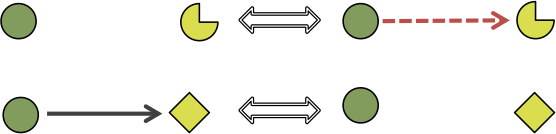
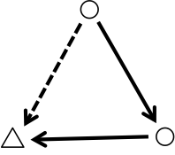

```{r setup, include=FALSE}
options(htmltools.dir.version = FALSE)
knitr::opts_chunk$set(echo = FALSE, tidy = TRUE, message = FALSE, warning = FALSE, dev = 'png')
```

```{r packages}
library(tidyverse)
library(geomnet)
library(RSiena)
library(lme4)
```

```{r loaddata}
load("data/finalglmm31-2.RDA")
turk22 <- read_csv("data/turk22-sig.csv")
```

# Outline 

- A social network example 
--

- What is a SAOM?
--

- Questions of interest
--

- Example visualizations
--

- What is the lineup protocol?
--

- Design of experiment
--

- Data collection 
--

- A GLMMer of hope
--

- Results
--

- Conclusions and future directions


---
class: inverse, center, middle 

# A social network example


---
class: plotslide, center

# Senate collaboration in the Obama years


???
A measure of collaboration in the US Congress is cosponsorship of legislation. Each bill brought in the senate has one primary author, and many senators can cosponsor a bill as an indication of their support for it. This is an example of a dynamic social network. In this data, the edges are directed and binary. An edge from senator A to senator B is drawn if senator A frequently cosponsors the legislation that senator B authored. (Skip exact definition of how we determined this, but I welcome questions if there is time.) For instance, in the 114th senate (bottom right corner), there is an edge from Harry Ried to Mitch McConnell, meaning in that session, Ried frequently cosponsored McConnell's legislation but not the other way around. 

---
class: inverse, center, middle

# What is a SAOM?

---
class: definition

# Stochastic Actor-Oriented Model (SAOM)

## A statistical model applied to *dynamic* social networks which takes both the *network structure* and the *node-level covariates* into account

???
These models stand out from the pack because of their ability to incorporate non-structural information and their ability to model network change in time. Most traditional models only consider one observation at a time. 

---

# How? 

- Assume *conditional independence* of actors / nodes 
--

- Estimate the *rate* at which actors make changes in the network 
--

- Maximize an actor's *objective function* when it makes a change

???
Everything is modeled at the actor-level. The actors are assumed to be conditionally independent given their current set of ties. Then, actors are individually "chosen" to make a tie change in continuous time. When an actor is chosen to change, it attempts to maximize its objective function by changing its relationship to other nodes. 

---
class: math

# Basic Notation 

$x$ - the current network state in the model

$x(t_1), \dots, x(t_M)$ - the observed network at the discrete time points $t_1, \dots, t_M$ 

$x_{ij}$ - the binary tie variable from actor $i$ to actor $j$, $i,j \in \{1, \dots, n = \text{# of actors}\}$

$x(i \leadsto j)$ - the network that only differs from $x$ by one tie, $x_{ij}$ 

$\alpha_m$ - the rate parameter for the period from $t_{m-1}$ to $t_m$

$\mathbf{Z}$ - an $n \times p$ matrix of $p$ actor-level covariates of interest

$\boldsymbol{\beta}$ - a $K \times 1$, $K>p$, vector of parameters in the objective function

$s_{ik}(x, \mathbf{Z})$ - a statistic computed for actor $i$ and parameter $k$ in the objective function

---
class: math 

# Rate parameter

- In period $m$, the waiting time $\tau_i$ until actor $i$'s next opportunity for change: $$\tau_i | x_{i1}, \dots, x_{in}\stackrel{iid}{\sim} Exp(\alpha_m)$$
- Expected value is $\alpha_m^{-1}$
- In period $m$, the waiting time $\tau$ until any actor gets to change: $$\tau(x|m) \sim  Exp(n\alpha_m)$$
- Expected value is $(n\alpha_m)^{-1}$

---
class: math

# Objective Function

Actor $i$ gets the opportunity to change, and attempts to maximize its *objective function*:
$$f_{i}(x, \boldsymbol{\beta}, \mathbf{Z}) = \sum_{k=1}^K \beta_{k} s_{ik}(x,\mathbf{Z}) + U$$
where $U$ is a random component encompassing all other reasons for change not in the objective function

---
class: math

# Some objective function parameters 

| Name | Parameter | Statistic | Picture |
|:-----|:---------:|:---------:|:--------:|
| density | $\beta_1$ | $s_{i1}(x) = \sum_j x_{ij}$|  |
| reciprocity | $\beta_2$ | $s_{i2}(x) = \sum_j x_{ij}x_{ji}$|  |
| covariate-alter | $\beta_3$ | $\sum_j x_{ij}z_j$ | |
| covariate-ego  | $\beta_5$ | $z_i\sum_j x_{ij}$ | |


???
There are many possible parameters to include in the objective function. This usually depends on subject area knowledge of the researcher to include the "right" parameters. I only show a few here. According to the literature, the first two, density and reciprocity, should always be included in the model. 

---
class: math 

# Transition Probability

- Actor $i$ given chance to change
- What is probability the tie $x_{ij}$ changes?

$$p_{ij} = \frac{\exp\{f_{i}(x(i \leadsto j), \boldsymbol{\beta}, \mathbf{Z})\}}{\sum_{h=1}^n \exp\{f_{i}(x(i \leadsto h), \boldsymbol{\beta}, \mathbf{Z})\}}$$
- Used in estimation and simulation

<!--??? Gloss over -->

---
class: inverse, center, middle

# Questions of interest

---
class: majorpoint

# What don't we know?

- Which parameters should we include in the model? 
--

- How do we interpret these parameters? 
--

- How do we know if the model we chose for our data is a "good" model? 

???
There are dozens of possible parameters. How can we possibly pick which ones to include? 
If the estimated value of beta 2 is 5, what does that mean about our data? What about if it's negative 5? 
What goodness of fit measures can we look at? 
We answer these question using data visualization, visual inference, and the lineup protocol. 

---
class: inverse, center, middle

# Example visualizations

---
class: plotslide, center

# What do you think? Are these two networks from the same model?

```{r compare1, fig.width=12.2, fig.height=8}
library(tidyverse)
library(geomnet)
dat <- read_csv("data/jttp_pos_easy_1.csv")
ggplot(data = dat %>% filter(ord %in% 1:2)) + 
        geom_net(aes(from_id = from, to_id = to), 
                 arrow = arrow(type = 'open', length = unit(2, "points") ), 
                 linewidth = .5, singletons = T, fiteach = T, directed = T, 
                 color = 'black', arrowgap = .015, arrowsize = .3, size =1) + 
        theme_net() + 
        theme(panel.background = element_rect(color = 'black')) +
        facet_wrap(~ord)
```

---
class: plotslide, center

# What about these? Are these two networks from the same model?

```{r compare2, fig.width=12.2, fig.height=8}
ggplot(data = dat %>% filter(ord %in% 3:4)) + 
        geom_net(aes(from_id = from, to_id = to), 
                 arrow = arrow(type = 'open', length = unit(2, "points") ), 
                 linewidth = .25, singletons = T, fiteach = T, directed = T, 
                 color = 'black', arrowgap = .015, arrowsize = .3, size =1) + 
        theme_net() + 
        theme(panel.background = element_rect(color = 'black')) +
        facet_wrap(~ord)
```

???
Plots 1,2,3 were all simulated from the same model, while plot 4 was simulated from a model with one additional parameter in the objective function. 

---
class: inverse, center, middle

# What is the lineup protocol?

---

# Lineup Idea


([Image Source](https://allthingslawandorder.blogspot.com/2017/05/law-order-svu-american-dream-sanctuary.html))
---
class: majorpoint

# Lineup protocol

- Have some data of interest and a visualization of that data
- Have a null hypothesis that the data come from a "null model"
- Simulate "null data" sets from the null model 
- Use the simulated data to create "null plots"
- Can you see the data plot among the null plots?
- Picking the data out among the nulls is evidence *against* the null model

---
class: definition

# Lineup

## The lineup protocol "asks the witness to *identify* the plot of the *real data* from among a set of decoys, the null plots, under the veil of ignorance" (Buja et al. 2009, p. 4369)

---
class: plotslide, center

# From Loy et al. (2017)


---
class: plotslide, center

# From our lineup experiment

```{r lineup1, fig.width=12.2, fig.height=8}
ggplot(data = dat) + 
        geom_net(aes(from_id = from, to_id = to), 
                 arrow = arrow(type = 'open', length = unit(2, "points") ), 
                 linewidth = .25, singletons = T, fiteach = T, directed = T, 
                 color = 'black', arrowgap = .015, arrowsize = .3, size =1) + 
        theme_net() + 
        theme(panel.background = element_rect(color = 'black')) +
        facet_wrap(~ord)
```

---
class: inverse, center, middle

# Design of experiment

---

# Experiment idea

- Pick several models and parameters in the objective function that we think are important to SAOMs
--

- Fit models to the Senate collaboration data to get estimates of $\boldsymbol{\beta}$
--

- Simulate network data from the models using the estimates, and place the plots of the data in various lineup configurations to determine:
--

    * Which parameters are significant? 
    * Which models are good fits?
    * Which parameters are noticeable and at what values? 

---
class: math

# Parameters of interest 

| Name | Parameter | Statistic | Picture |
|:-----|:---------:|:---------:|:--------:|
| jumping transitive triplet - party (jttp)| $\beta_3$ | $s_{i3}(x, \mathbf{p}) = \sum_{j\neq h} x_{ij}x_{ih}x_{hj}\cdot \mathbb{I}(p_i = p_h \neq p_j)$ | |
| jumping transitive triplet - sex (jtts) | $\beta_4$ | $s_{i4}(x, \mathbf{s}) = \sum_{j\neq h} x_{ij}x_{ih}x_{hj}\cdot \mathbb{I}(s_i = s_h \neq s_j)$ | |
| similarity transitive triplet - bills (simttb) | $\beta_5$ | $s_{i5}(x, \mathbf{b}) = \sum_{j} x_{ij}x_{ih}x_{hj}\cdot (sim^b_{ij} - \overline{sim}^b)^*$ | |
| same transitive triplet - party (samettp) | $\beta_6$ | $s_{i6}(x, \mathbf{p}) =\sum_{j} x_{ij}x_{ih}x_{hj}\cdot \mathbb{I}(p_i = p_j)$ | |

*- $sim^b_{ij} = \frac{\max_{hk}|b_h - b_k| - |b_i - b_j|}{\max_{hk}|b_h - b_k|}$

???
In addition to the two basic structural parameters, density and reciprocity, we examine four additional covariate parameters. We selected these parameters because they were highly significant according to the traditional Wald-type tests built into the RSiena software. 

---
class: math

# Models for testing

- Model M1: $f_{i}(x, \boldsymbol{\beta}) = \beta_1 s_{i1}(x) + \beta_2 s_{i2}(x)$
--

- Model M2: $f_{i}(x, \boldsymbol{\beta}, \mathbf{p}) = \beta_1 s_{i1}(x) + \beta_2 s_{i2}(x) + \beta_3 s_{i3}(x, \mathbf{p})$
--

- Model M3: $f_{i}(x, \boldsymbol{\beta}, \mathbf{s}) = \beta_1 s_{i1}(x) + \beta_2 s_{i2}(x) + \beta_4 s_{i4}(x, \mathbf{s})$
--

- Model M4: $f_{i}(x, \boldsymbol{\beta}, \mathbf{b}) = \beta_1 s_{i1}(x) + \beta_2 s_{i2}(x) + \beta_5 s_{i5}(x, \mathbf{b})$
--

- Model M5: $f_{i}(x, \boldsymbol{\beta}, \mathbf{p}) = \beta_1 s_{i1}(x) + \beta_2 s_{i2}(x) + \beta_6 s_{i6}(x, \mathbf{p})$
--

- Model M6: $f_{i}(x, \boldsymbol{\beta}, \mathbf{p}, \mathbf{b}, \mathbf{s}) = \beta_1 s_{i1}(x) + \beta_2 s_{i2}(x) + \beta_4 s_{i4}(x, \mathbf{s}) + \beta_5 s_{i5}(x, \mathbf{b}) + \beta_6 s_{i6}(x, \mathbf{p})$
--

Estimates of $\beta_1, \dots, \beta_6$ calculated by `RSiena` by estimating models M1-M5 1,000 times and computing means. For model M6, 100 estimates were obtained. Estimates are denoted $\hat{\beta}_1, \dots, \hat{\beta}_6$


---
class: majorpoint

# Hypotheses for significance test

For $k \in \{3, 4\}$

$H_0$: $\beta_k = 0$

$H_A$: $\beta_k \neq 0$

**Null model** for generating 5 null plots in the lineup: M1 ($\beta_1 = \hat{\beta}_1, \beta_2 =\hat{\beta}_2$)

**Alternative model** for generating 1 alternative plot in the lineup: 

- M2 ($\beta_1 = \hat{\beta}_1, \beta_2 =\hat{\beta}_2, \beta_3 =\hat{\beta}_3$) or 
- M3 ($\beta_1 = \hat{\beta}_1, \beta_2 =\hat{\beta}_2, \beta_4 =\hat{\beta}_4$)

---
class: majorpoint

# Hypotheses for goodness-of-fit test

For $i$ in $\{2,3,4,6\}$

$H_0$: Model M$i$ generated the network data

$H_A$: The network data do not come from the null model. 

**Null model** for generating 5 null plots in the lineup: 

- M2 ($\beta_1 = \hat{\beta}_1, \beta_2 =\hat{\beta}_2, \beta_3 =\hat{\beta}_3$) or 
- M3  ($\beta_1 = \hat{\beta}_1, \beta_2 =\hat{\beta}_2, \beta_4 =\hat{\beta}_4$) or 
- M4 ($\beta_1 = \hat{\beta}_1, \beta_2 = \hat{\beta_2}, \beta_5 = \hat{\beta}_5$) or 
- M6 ($\beta_1 = \hat{\beta}_1, \beta_2 =\hat{\beta}_2, \beta_4 =\hat{\beta}_4, \beta_5 =\hat{\beta}_5,\beta_6 =\hat{\beta}_6 $)

**Alternative model**: unknown, use the data as the alternative plot

---
class: majorpoint

# Hypotheses for power

$H_0$: $\beta_k = 0$

$H_A$: $\beta_k \neq 0$

**Null model** for generating 5 null plots in the lineup: M1 ($\beta_1 = \hat{\beta}_1, \beta_2 =\hat{\beta}_2$)

**Alternative model** for generating 1 alternative plot in the lineup:

- M1 for 3 values of $\beta_1$ less than $\hat{\beta}_1$ and 3 values of $\beta_1$ greater than $\hat{\beta}_1$
- M1 for 3 values of $\beta_2$ less than $\hat{\beta}_2$ and 3 values of $\beta_2$ greater than $\hat{\beta}_2$
- M2 for 3 values of $\beta_3$ less than $\hat{\beta}_3$ and 3 values of $\beta_3$ greater than $\hat{\beta}_3$
- M3 for 3 values of $\beta_4$ greater than $\hat{\beta}_4$
- M4 for 3 values of $\beta_5$ less than $\hat{\beta}_5$ and 3 values of $\beta_5$ greater than $\hat{\beta}_5$
- M5 for 3 values of $\beta_6$ greater than $\hat{\beta}_6$

---
class: majorpoint

# Additional hypotheses

Why? 


---
class: inverse, center, middle

# Data Collection

---

# App interface


---

# Amazon MTurk

- 250 participants recruited through Amazon Mechanical Turk 
- Each was presented the instructions and provided demographic information, two trial plots, and then 13 lineups to identify which plot was most different from the others
- Participants were paid $1.75

---
class: inverse, center, middle

# A GLMMer of hope

---
class: math

# Hierarchical model

Binary response variable $Y_{ijkm}$ indicating whether participant $m$ selected the alternative data plot in the $k^{th}$ repitition of a lineup of parameter $i$ and type $j$. 

$$Y_{ijkm} \sim \text{Bernoulli}(\pi_{ijkm})$$
$$\text{logit}(\pi_{ijkm}) = \alpha_{ij} + \beta_{ij} x + \delta_{ijk} + \epsilon_{m}$$
$$\delta_{ijk} \stackrel{iid}{\sim} N(0, \sigma^2_{\delta})$$
$$\epsilon_{m} \stackrel{iid}{\sim} N(0, \sigma^2_{\epsilon})$$ 

$x$ is the value of $\beta$, centered and scaled

$\delta_{ijk}$ is the random effect for lineup

$\epsilon_{m}$ is the random effect for viewer


---
class: math

# Predicting for new repitition, new observer

$$E[\text{logit}(\pi_{ij})] = \alpha_{ij} + \beta_{ij} x$$

---
class: inverse, center, middle

# Results

---
class: plotslide

# Model Predictions

```{r, fig.width = 12.2, fig.height=8}
newdata <- read_csv("data/newdata_pred_glmm.csv")
newdata$lps_param <- with(newdata, interaction(test_param, as.factor(type2)))
newdata$predictfinal <- predict(model2randomscalesize, newdata, allow.new.levels = T, type = 'response')
newdata$param <- newdata$test_param
newdata$param <- as.factor(newdata$test_param)
levels(newdata$param) <-  c(1,3,4,2,6,5) 
newdata$param <- as.integer(as.character(newdata$param))
plotdata <- turk22 %>% mutate(type2 = ifelse(sign == 0, sign(initialEst), sign),
                       type2 = ifelse(type == "one", type2, -1)) %>% 
  group_by(pic_id, size, test_param, sign, type2,alt_model) %>% summarize(
    datapick = mean(datapick)
)
plotdata$param <- plotdata$test_param
plotdata$param <- as.factor(plotdata$param)
levels(plotdata$param) <- c(1,3,4,2,6,5) 
plotdata$param <- as.integer(as.character(plotdata$param))
labdat <- data_frame(test_param = "jttp", param = 3, type2 = -1, x = -5, y = .9, label = "jttp_neg_hard_2")

ggplot() + 
  geom_line(data = newdata, aes(x = size, y = predictfinal, color = as.factor(type2))) + 
  geom_point(data = plotdata, aes(x = size, y = datapick, color = as.factor(type2))) + 
  #geom_text(data = plotdata, aes(x = size, y = datapick, color = as.factor(type2), label = pic_id)) +
  #geom_text(data = labdat, aes(x = x, y=y, label = label, color = as.factor(type2)),
  #          show.legend = F) + 
  geom_hline(yintercept = 1/6, linetype='dashed') +
  scale_color_brewer(palette = "Dark2", name = "Lineup Type") + 
  facet_wrap(~param, scales = 'free_x', 
             labeller = label_bquote(beta [.(param)])) + 
  labs(x = "Parameter value", y = "Expected probability of detection in a lineup of size 6") + 
  theme_bw() + 
  theme(legend.position = 'bottom')
```

---
class: plotslide, center

# $\beta_2$ in more detail

```{r recipzoom, fig.width=12.2, fig.height=8}
ggplot() + 
  geom_line(data = newdata %>% filter(test_param == "recip"), aes(x = sqrt(size), y = predictfinal, color = as.factor(type2))) + 
  geom_point(data = plotdata %>% filter(test_param == "recip"), aes(x = sqrt(size), y = datapick, color = as.factor(type2))) + 
  scale_color_brewer(palette = "Dark2", name = "Lineup Type") + 
  geom_hline(yintercept = 1/6, linetype='dashed') + 
  facet_wrap(~type2, scales = 'free_x') + 
  labs(x = "Square root of parameter value (recip)", y = "Expected probability of detection\nin a lineup of size 6") + 
  theme(legend.position = 'bottom')
```

---
class: inverse, center, middle

# Conclusions and future directions

---

# References 
