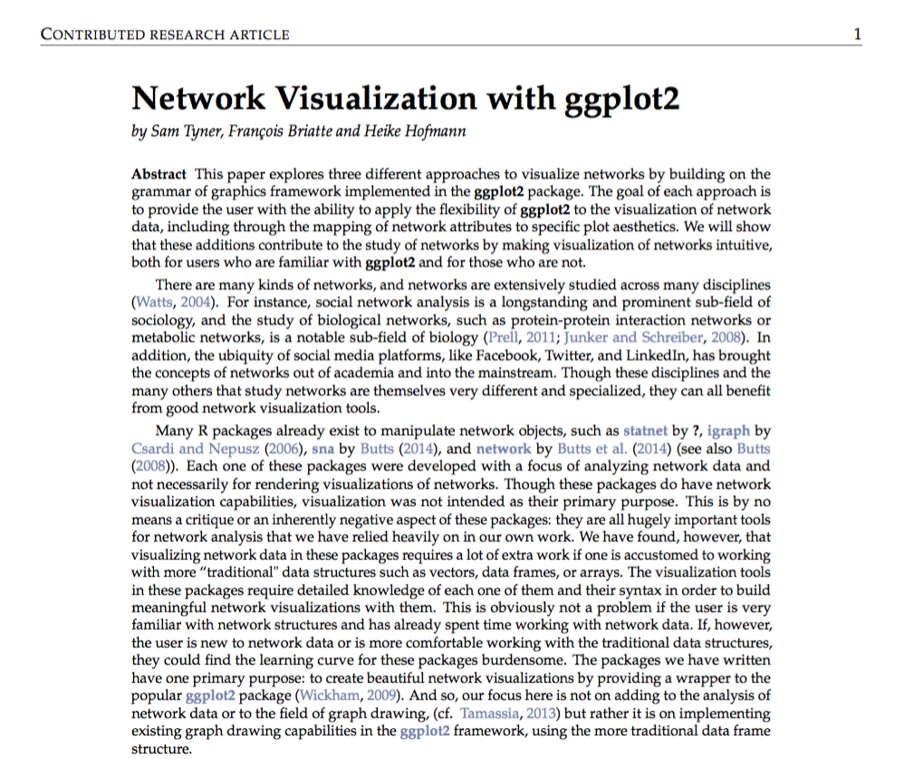
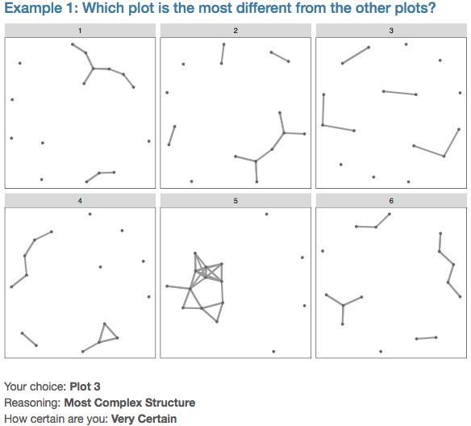
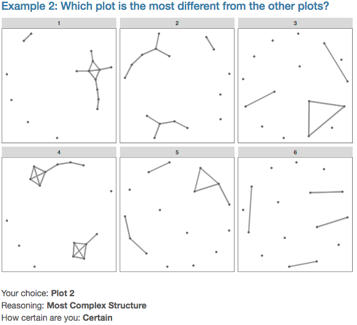
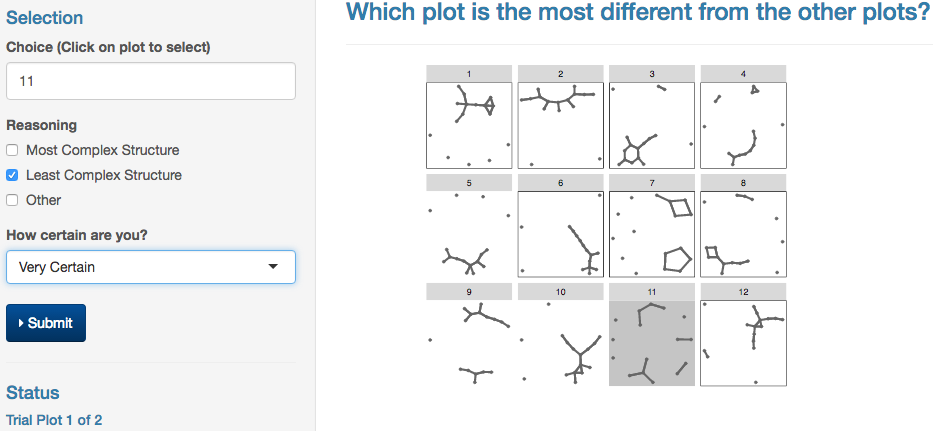
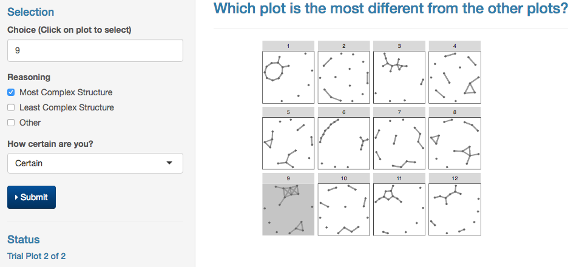

```{r setup, include=FALSE}
knitr::opts_chunk$set(echo = FALSE, message = FALSE, warning = FALSE, cache = TRUE)
library(dplyr)
library(ggplot2)
library(geomnet)
library(network)
library(sna)
library(igraph)
library(tidyr)
library(RSiena)
library(knitr)
```

## About Me
* Bachelor of Arts, Augustana College, Rock Island, IL, 2012
    + Majors: Mathematics, Economics, French
* Master of Science, Iowa State University, Ames, IA, 2015
    + "A geometry for network visualization in `ggplot2`"
* Passed PhD written examination, Summer 2014
* Aim to defend April 2017, graduate May 2017

## Thesis Outline

- Chapter 1 - *Stochastic Actor-Oriented Models for Longitudinal Network Data: Removing the Blindfold*
- Chapter 2 - *Model Diagnostics for Stochastic Actor-Oriented Models Using Visual Inference*
- Chapter 3 - *Drawing Networks in the `ggplot2` Framework*

## Outline of Talk

- Motivation and Background
- Chapter 3: The `R` Package `geomnet`
- Chapter 1: Stochastic Actor-Oriented Models for Longitudinal Network Data: Removing the Blindfold
- Chapter 2: Model Diagnostics for Stochastic Actor-Oriented Models Using Visual Inference
- Thesis Timeline

# Motivation and Background

## Social Networks

- "The Small World Problem" (Milgram 1967)
- Increased ease of data collection


[Image source](http://www.readingeagle.com/storyimage/RE/20140328/LIFE/303289993/AR/0/AR-303289993.jpg&q=80&MaxW=550&MaxH=400&RCRadius=5)

## Statistical Models for Social Networks

- Erdös-Rényi Simple Random Graph Model
- Exponential Random Graph Model (ERGMs)
- Stochastic Actor-Oriented Models (SAOMs)

## Simple Example

Observed network (or graph), $x$ 
```{r, echo = FALSE, fig.align='center', fig.height=5}
set.seed(123456789)
nodes <- data.frame(id = LETTERS[1:5], x = c(1,1,2,2,3), y = c(1,2,1,2,1.5), label = 1:5)
edges <- data.frame(from = LETTERS[sample(5, 5)], to = LETTERS[sample(5, 5)])
net <- merge(edges, nodes, by.x = "from", by.y = "id", all = T)
edgelabels <- data.frame(label = LETTERS[1:5], 
                         x = c(.85,1.5,1.55,2.65,2.35), 
                         y = c(1.5, .9,1.45,1.8,1.65))
ggplot() + 
  geom_net(data = net, labelcolour = "forestgreen",
           layout = NULL, directed = T, size = 12, 
           color = 'black', shape = 1, vjust = .5, arrowgap = .08,
           ecolour = 'grey40', curvature = .1, fontsize = 10,
           aes(x = x, y = y, from_id = from, to_id = to, label = label)) + 
  #geom_text(data = edgelabels, size = 5,
  #          aes(x = x, y = y, label = label)) + 
  theme_net()
```

## Basic Definitions & Notation

- Observed network: $x$
- Unobserved network: $X$
- Nodes: $\mathcal{N} = \{1,\dots, n\}$
- Edges: $x_{ij}=$ tie between nodes $i$ and $j$ $x_{ij}$, for $i \neq j \in \mathcal{N}$. Edgeset is $\mathcal{E} = \{x_{ij}\}_{i \neq j \in \mathcal{N}}$
    + $x_{ij} = 1$ $\Rightarrow$ Tie between $i$ and $j$ exists
    + Example: directed edges i.e. $x_{12} = 1 \neq x_{21} = 0$ 
    + Undirected: $x_{ij} = x_{ji}$
    + Self-ties/Loops: $x_{ii} = 0$ for all $i \in \mathcal{N}$
- Node degree: edges incident to the node

## Erdös-Rényi Random Graph Model
For *undirected* graphs. First random graph model [@er59]. 

- Start with $n$ nodes
- Ties $x_{ij}$ chosen at random from $\binom{n}{2}$ possible ties
- $Pr(x_{ij} = 1) = p$ for any $i \neq j \in \{1, \dots, n\}$
- Very simple: easily write down likelihood and estimate $p$ 
- Let $e = \sum_{i < j} x_{ij}$ be the number of edges. Then, $e$ has likelihood:

$$ f(e| p, n) = p^{e}(1-p)^{\binom{n}{2} - e} $$

## Pros and Cons of Erdös-Rényi Model

Pros:

- simple
- tractable
- easily find MLE of $p$: $\hat{p} = \dfrac{e}{\binom{n}{2}}$ 
- properties and asymptotic behavior well-understood

Cons:

- too simplistic
    + nodes all have about same degree
    + doesn't capture properties of observed networks

## Exponential Random Graph Models {.smaller}
Created to model directed and undirected networks more realistically. Also called $p^*$ models [@p1model]. 

Structural properties of graph become sufficient statistics
    
- Outdegree: count edges from node $i$, $x_{i+} = \sum_j x_{ij}$
- Reciprocity: count reciprocated ties from node $i$, $\sum_j x_{ij}x_{ji}$
- Count $e$-stars, $s_{k_e}(x) = \sum_i \binom{x_{i+}}{e}$
- Count triangles: $s_{k_t}(x) = \sum_{i \neq j \neq h} x_{ij}x_{ih}x_{jh}$

```{r exs, echo=FALSE, out.width="80%", fig.height=2.7, fig.align='center'}
nodes <- data.frame(id = c(1:3, letters[1:4]), 
                    group = rep(c("Triangle", "3-Star"), c(3,4)), 
                    x = c(1,1.5,2,1,.5,1,1.5), 
                    y = c(1,2,1,1.5,2,1,2))
edges <- data.frame(from = c(1,2,3, rep("a", 3)),
                    to = c(c(2,3,1), letters[2:4]))
net <- merge(edges, nodes, by.x = "from", by.y = "id", all = T)
set.seed(12345)
ggplot() + 
  geom_net(data = net, label = T, size = 7, 
           labelcolour = 'white', vjust = .4,
           ecolour = 'grey40', color = 'black', fiteach = T,
           aes(from_id = from, to_id = to)) + 
  theme_net() + 
  facet_wrap(~group)
```

## ERGM Likelihood

For a network, $x$: 
 
$$f(x|\boldsymbol{\beta}) = \frac{1}{\psi(\boldsymbol{\beta})}\exp\left(\sum_k \beta_k s_k(x) \right),$$ 

- $\beta_k$: parameters corresponding to $K$ sufficient statistics (e.g. number of triangles and $e$-stars in $x$)
- $\psi(\beta)$: the normalizing constant. 
    + depends on the parameters
    + makes parameter estimation very difficult
    + Estimation via MCMC or pseudo-likelihood done instead

## Pros and Cons of ERGMs

Pros: 

- Better captures real-world network properties 
- MCMC estimation is well-established

Cons: 

- Statistics aren't independent, can lead to degeneracy [@Robins2007]
- Full form of likelihood often unknown due to complicated nature of normalizing constant 

## Stochastic Actor-Oriented Models

- First introduced in @saompaper
- *Longitudinal* network data
- Capture the process of network change over time
- Allow node level covariates to affect structure

## Definitions and Notation

- $\mathcal{X}$: For a set of $n$ nodes, the set of $2^{n(n-1)}$ possible directed networks in those nodes. 
- *Longitudinal network*: a constant set of $n$ nodes whose ties change in time
    + Observed at $M$ discrete time points, $t_1, \dots, t_M$
    + Denote the observations $x(t_1), \dots, x(t_M) \in \mathcal{X}$
- *Continuous time Markov Chain* (CTMC): SAOMs assume $x(t_1), \dots, x(t_M)$ are embedded within a CTMC, $X(T) \in \mathcal{X}$.  
    + Composed of single tie changes
    + Changes can arise at a different rate for each actor
    + Given the chance to change, actor maximizes its utility

## Model Assumptions

1. Assume conditional independence of network observations 
2. Assume conditional independence of nodes given their ties
    
## Model Setup

From observation $x(t_{m-1})$ to $x(t_m)$:

1. Actors act (i.e. change ties with others) at some rate, $\lambda_i(\alpha, \rho, x, m)$
2. One actor at a time may change a tie, so that only one tie changes at a time in the CTMC
2. When changing at tie, each actor aims to maximize its objective function $$f_i(\boldsymbol{\beta},x, \mathbf{Z}) = \sum_k \beta_k s_{ik}(x, \mathbf{Z})$$
where $x$ is the network state, $\boldsymbol{\beta}$ are parameters, and $\mathbf{Z}$ are node-level covariates
    
## Actor-Level Rate Function
For each actor $i \in \{1,\dots, n\}$:

$$\lambda_i(\alpha, \rho, x, m)$$

- $\alpha$: rate parameter
- $\rho$: parameter(s) corresponding to actor covariate(s)
- $x \in \mathcal{X}$: current state of the network
- $m$: time point of the current network observation, $t_m$

At time $T$, $t_{m} \leq T < t_{m+1}$, the waiting time to the next change opportunity by actor $i$ has distribution:  $$\textit{Exp}\big(\lambda_i(\alpha, \rho, x, m)\big)$$.

## Network-Level Rate Function

Assume actors are conditionally independent given their ties, $x_{i1}, \dots, x_{in}$ 

Write the rate function for the whole network: 
$$\lambda(\alpha, \rho, x, m) = \sum_i \lambda_i(\alpha, \rho, x, m).$$ 
At any time $T$, $t_{m} \leq T < t_{m+1}$, waiting time to the next change opportunity by *any* actor in the network has distribution 
$$\textit{Exp}\big(\lambda(\alpha, \rho, x, m)\big)$$


## Objective Function {.smaller}

Assume node $i$ can change:

- $n$ possible steps $i$ can take: 
    + A current tie will be destroyed
    + A new tie will be created 
    + No change will occur
- Change made to maximize its objective function: 

$$f_i(\boldsymbol{\beta}, x, \mathbf{Z}) = \sum_k \beta_k s_{ik}(x, \mathbf{Z}),$$

- $x \in \mathcal{X}$: current network state
- $\mathbf{Z}$: covariates matrix
- $\boldsymbol{\beta}$: parameters of the model
- $s_{ik}(x, \mathbf{Z})$, for $k = 1,\dots, K$: network and covariate statistics corresponding to the $\beta_k$

## Probabilities of Changes

1. Probability that node $i$ gets the next opportunity to change:
$$\frac{\lambda_i(\alpha, \rho, x, m)}{\lambda(\alpha, \rho, x, m)}$$

2. Probability that, when given opportunity to change, node $i$ changes its tie to node $j$: 
$$p_{ij}(\boldsymbol{\beta}, x, \mathbf{Z}) = \frac{\exp\left\{f_i(\boldsymbol{\beta}, x(i \leadsto j))\right\}}{\sum_{h \neq i} \exp\left\{f_i(\boldsymbol{\beta}, x(i \leadsto h))\right\}}$$
where $x(i \leadsto j)$ is the same network as $x$ with the exception of the tie $x_{ij}$. 

## Sufficient Statistics 

Recall: $\beta_k$ correspond to the $s_{ik}(x, \mathbf{Z})$. 

There should be two $s_{ik}$ at minimum [@snijders01 p. 371]:

- $s_{i1}(x)$: popularity (outdegree)
- $s_{i2}(x)$: reciprocity

Many possible structures, $s_{ik}(x, \mathbf{Z})$, belonging to two groups: 

- Structural effects: only depend on network structure
- Covariate effects: depend on interaction of network structure and actor covariate values

## Examples of Structural Statistics

Structural Effect | Sufficient Statistic
------------------|----------------------
outdegree         | $s_{i1}(x) = \sum_j x_{ij}$ 
reciprocity       | $s_{i2}(x) = \sum_j x_{ij}x_{ji}$
transitive triplets | $s_{i3}(x) = \sum_{j,h} x_{ij}x_{jh}x_{ih}$

## Examples of Covariate Statistics
Covariate Effect | Sufficient Statistic
-----------------|----------------------
covariate-alter  | $s_{i4}(x) = \sum_j x_{ij}z_j$
covariate-ego    | $s_{i5}(x) = z_i\sum_j x_{ij}$
same covariate   | $s_{i6}(x) = \sum_j x_{ij} \mathbb{I}(z_i = z_j)$

## SAOM Likelihood Function

SAOMs are "too complicated for the calculation of likelihoods or estimators in closed form" [@snijders2010, p. 568]

Likelihood first presented in @snijders2010

- Uses augmenting data principle of @dataaug. 
- Likelihood in augmented data form using a constant rate function presented in detail in [Appendix A](#70))

## Longitudinal Network Data Example 

```{r vizex, width = "100%"}
friend.data.w1 <- as.matrix(read.table("VisInfDocs/Data/s50_data/s50-network1.dat"))
friend.data.w2 <- as.matrix(read.table("VisInfDocs/Data/s50_data/s50-network2.dat"))
friend.data.w3 <- as.matrix(read.table("VisInfDocs/Data/s50_data/s50-network3.dat"))
drink <- as.matrix(read.table("VisInfDocs/Data/s50_data/s50-alcohol.dat"))
fdf1 <- data.frame(friend.data.w1)
fdf1$id <- 1:50
fdf2 <- data.frame(friend.data.w2)
fdf2$id <- 1:50
fdf3 <- data.frame(friend.data.w3)
fdf3$id <- 1:50

fdf1.2 <- fdf1 %>% tidyr::gather(id) 
names(fdf1.2) <- c("from", "to", "value")
fdf2.2 <- fdf2 %>% tidyr::gather(id) 
names(fdf2.2) <- c("from", "to", "value")
fdf3.2 <- fdf3 %>% tidyr::gather(id) 
names(fdf3.2) <- c("from", "to", "value")
fdf1.2$to <- fdf1.2$to %>% readr::parse_number()
fdf1.2$timepoint <- 1
fdf2.2$to <- fdf2.2$to %>% readr::parse_number()
fdf2.2$timepoint <- 2
fdf3.2$to <- fdf3.2$to %>% readr::parse_number()
fdf3.2$timepoint <- 3
fdf <- rbind(fdf1.2, fdf2.2, fdf3.2)
ddf <- data.frame(drink)
ddf$id <- 1:50
ddf <- ddf %>% gather(key = id)
names(ddf) <- c("id", "timepoint","drink")
ddf$timepoint <- as.factor(ddf$timepoint)
levels(ddf$timepoint) <- 1:3
ddf$timepoint <- as.numeric(as.character(ddf$timepoint))
fdf <- filter(fdf, value == 1)
net <- full_join(fdf, ddf, c("from"="id" ,"timepoint"="timepoint"))
ggplot(data = net) + 
  geom_net(aes(from_id = from, to_id = to, color = as.factor(drink)), directed = T, fiteach = T, size = 2, arrowsize = .35, linewidth = .2) + 
  scale_colour_brewer(palette = "Dark2",name = "Covariate") + 
  facet_wrap(~timepoint, labeller = "label_both") + 
  theme_net() + theme(legend.position = 'bottom')
```

## Network Visualization

- Data non-traditional, visualizations are non-traditional
    + Putting points, curves, etc. in 2D holds no meaning for network data
- Layout algorithms: place nodes based on their connections
    + Force directed layouts: Kamada-Kawai, Fruchterman Reingold, etc.
    + Matrix based layouts: MDS, Eigen, etc.
- Can make up lost information:
    + Arrows: indicate direction
    + Point: shapes, colors, sizes to indicate node variables
    + Segments: size, color, linetype to indicate edge variables
- Can do all of the above in `geomnet`

## Why use `ggplot2`?

- Other packages: `network`, `sna`, `igraph`, etc
    + Require more specific knowledge
    + Packages designed for analysis, not visualization
- Target audience: current `ggplot2` package users
    + `geomnet` only needs data frames
    + basic structure, easily describes networks

# Chapter 3: *The `R` package `geomnet`*

## Basics

- on CRAN
- Built on `ggplot2`
- Key functions: `geom_net()`, `stat_net()`
- Other functions: `geom_circle()`, `jtt()`
- Added functionality: `geom_curve()`, `geom_label()`, `ggrepel`

## Data for `geom_net()`

- 2 sets of information: node data and edge data 
    + Node data: node ids and information on the nodes
    + Edge data: `from` node id and `to` node id for each each edge and information on the edges
- Node and edge data must be merged

## Data Example

```{r example, echo=FALSE}
library(ggplot2)
library(geomnet)
nodes <- data.frame(id = letters[1:5], color = c('red','blue','red','blue','red'))
edges <- data.frame(from_id = letters[c(1:5, 1:5)], to_id = letters[sample(1:5, 10, replace = T)])
levels(nodes$color) <- c("red", "blue")
nodes
edges
```

## Merge Data

```{r example2, echo=TRUE}
combined <- merge(edges, nodes, 
                  by.x = 'from_id', by.y = 'id', all = T)
combined
```

## Example Plot & Code

```{r plotex, echo=T, message=FALSE, warning = FALSE, fig.align='center', fig.height=3.5}
ggplot(data = combined) + 
  geom_net(aes(from_id = from_id, to_id=to_id, 
               color = color, group = color), 
           selfies = T, directed = T, label = T, 
           labelcolour = 'black', curvature = .1) + 
  theme_net()
```


## Other `geom_net()` Arguments

- For layouts: `layout, layout.par, fiteach`
- For directed networks: `arrowsize, arrow, arrowgap`
- For edges: `ealpha, ecolour`

## Paper on `geomnet`

*Network Visualization with `ggplot2`* with Heike Hofmann and François Briatte

- Accepted for publication in *The R Journal* subject to revisions
- 2 independently developed packages: `geomnet` and `ggnetwork` (Briatte)



# Chapter 1: *SAOMs: Removing the Blindfold*

## High-Level Questions

- What does the underlying continuous time Markov chain look like?
- What makes two network models different?
    + What makes networks simulated from those models different? 
    + What is an "average" network from a model given a set of $s_{k}$s? 

## Research Plan

- Visualization of fitting process of SAOMs
- Visualize the distribution of network objects
- Comparison of network objects
    + Distance measures for networks [see @Ginestet14]
    + Structural PCA / Clustering

## Small First Step {.smaller}

- 1000 simulations from a SAOM 
- Count edge appearances: 
    + mean: 59.21
    + median: 21
- An "average" network: edges appear $\geq 59$ times

```{r, fig.align='center', fig.height = 3.5}
whats <- read.csv("BlindfoldDocs/1000_sims_m1.csv", stringsAsFactors = F)
names(whats)[2:3] <- c("from", "to")
whats %>% group_by(from, to) %>% summarise(count = n()) %>%
  filter(!is.na(to)) %>% mutate(weight = ifelse(from==to, 0, count)) -> weight_whats

weight_whats %>% ungroup() %>% 
  group_by(from) %>% 
  mutate(outdegree = sum(weight)/1000) %>%
  ungroup() %>% group_by(to) %>% 
  mutate(indegree = sum(weight)/1000,
         tot.degree = indegree + outdegree) -> weight_whats2

# ggplot(data = whats) + 
#    geom_net(aes(from_id = from, to_id = to), label = T) +
#   theme_net()

ggplot(data = weight_whats2 %>% filter(weight > 59)) + 
  geom_net(aes(from_id = from, to_id = to, linewidth = weight/200), alpha = .5, shape = 1, vjust = .4,
           label = T, directed = T, arrow = arrow(type = 'open', angle = 20, length = unit(.25, "cm")),
          labelgeom = 'label', labelcolour = 'white', color = 'black', arrowgap = .04, ecolour = "grey40") + 
  theme_net()
```

# Chapter 2: *Model Diagnostics for SAOMs Using Visual Inference*

## Motivation & Objectives

- Use visual tools to diagnose the effect of parameters in SAOM models
- Learn about the practical relevance of effects
- Perform model selection using visual inference methods

Why?

- Many effects to choose from (88 in `RSiena` software)
- Significance tests exist, but have practical limitations. 
    + Do they have a visible effect on structure of the network?
    + Motivating Example: jumping transitive triplets parameter in friends data


## Motivating Example: Friendship Network {.smaller}

Small, $n = 16$ subset of data from @friendsdata. 

- Network observed at three timepoints describing friendships between teenage girls in a Scottish school
- Also contains behavior information on the girls: smoking, drinking, etc.

```{r, echo = FALSE, message=FALSE, warning=FALSE, fig.heigh=4}
library(sna)
library(network)
friend.data.w1 <- as.matrix(read.table("VisInfDocs/Data/s50_data/s50-network1.dat"))
friend.data.w2 <- as.matrix(read.table("VisInfDocs/Data/s50_data/s50-network2.dat"))
fd2.w1 <- friend.data.w1[20:35,20:35]
fd2.w2 <- friend.data.w2[20:35,20:35]
drink <- as.matrix(read.table("VisInfDocs/Data/s50_data/s50-alcohol.dat"))
drink2 <- drink[20:35,]
actual1 <- merge(data.frame(as.edgelist(as.network(fd2.w1))), 
                 data.frame(id = 1:16, drink = drink2[,1]), 
                 by.x = "X1", by.y = "id", all = T)
for (j in 1:nrow(actual1)){
      if (!(actual1$X1[j] %in% actual1$X2) & is.na(actual1$X2[j])){
        actual1$X2[j] <- actual1$X1[j]
      } else {actual1$X2[j] <- actual1$X2[j]}
}
actual2 <- merge(data.frame(as.edgelist(as.network(fd2.w2))), 
                 data.frame(id = 1:16, drink = drink2[,2]), 
                 by.x = "X1", by.y = "id", all = T)
for (j in 1:nrow(actual2)){
      if (!(actual2$X1[j] %in% actual2$X2) & is.na(actual2$X2[j])){
        actual2$X2[j] <- actual2$X1[j]
      } else {actual2$X2[j] <- actual2$X2[j]}
    }
actual1$wave <- 1
actual2$wave <- 2

waves <- rbind(actual1, actual2)
library(geomnet)
actual1$behaviour <- factor(actual1$drink)
levels(actual1$behaviour) <- c("None", "Once or twice a year", "Once a month", "Once a week")
set.seed(34567)
ggplot(data = actual1, aes(from_id = X1, to_id = X2)) + 
  geom_net(label = TRUE, hjust = 0.5, vjust=0.5, size=9,  
          labelcolour = "grey20", directed = T, arrowgap = .04,
           aes(colour = behaviour)) + 
  scale_colour_brewer("Drinking behavior", palette="YlOrRd") +
  theme_net() 

# ggplot(data = waves, aes(from_id = X1, to_id = X2)) + 
#   geom_net(label = TRUE, hjust = -.5, labelcolour = 'black', fiteach = T,
#            aes(color = as.factor(drink))) + 
#   theme_net() + theme(panel.background = element_rect(fill = "white", color = 'black')) + facet_wrap(~wave)
```

## Rate Parameters  

- Constant over actors: how often girls change friendships between observations
- Rate function from $x(t_{m-1})$ to $x(t_m)$ for $m = 2, 3$:
$$\lambda_i(\alpha, \rho, x, m) = \alpha_m$$
- Corresponding sufficient statistic: 
$$C_m = \sum_{ij} \big|x_{ij}(t_{m}) - x_{ij}(t_{m-1})\big| $$


## Objective Function Parameters

1. Outdegree ($\beta_1$)- measure of activeness / popularity
2. Reciprocity ($\beta_2$) - how often girls' friendships are reciprocated
3. Jumping Transitive Triplets (JTT) ($\beta_3$) - friends of the same person become friends despite behavior differences

```{r, echo = FALSE, fig.height=2}
jTTe <- data.frame(from = c('i', 'i', 'h'), to = c('h', 'j', 'j'))
jTTn <- data.frame(id = letters[8:10], group = c(1,1,2))

jTT <- merge(jTTe, jTTn, by.x = 'from', by.y = "id", all = T)

set.seed(12345) 
ggplot(data = jTT, aes(from_id = from, to_id = to)) + 
  geom_net(aes(shape = as.factor(group)), directed = T, label = T, 
           labelcolour='grey80',vjust = 0.5, hjust =0.5, arrowgap = .15, 
           colour = 'black', size=10, 
           ecolour = c("red", "grey40", "grey40", "grey40")) + 
  expand_limits(x=c(-0.1,1.1), y=c(-0.1,1.1)) +
  theme_net() +
  theme(legend.position = "none")
```

## Model Fitting

Done in the R package `RSiena` by @RSiena.

MCMC methods used for method of moments estimators of the objective function parameters.

Also allows for simulation from model given values of the parameters $\alpha_m$, $\boldsymbol{\beta}$

## Parameter Choice

- Outdegree and reciprocity always included
- JTT chosen for high level of significance according to Wald-type tests in `RSiena`


## Two Models {.smaller}

```{r echo=FALSE, eval=FALSE}
A<- c(1, rep(0,4))

library(RSienaTest)
Multipar.RSiena(runs_models_smallFriends[[1]], 1)
Multipar.RSiena(runs_models_smallFriends[[1]], 2)
```

Effect name | Parameter | Corresponding Statistic | M1 | M2 | p-value M1 | p-value M2 |
:------------:|:-----------:|:-------------------------:|:----:|:----:|:--------:|:----:
Rate 1 (timepoint 1 $\rightarrow$ 2) | $\alpha_1$ | $\sum\limits_{i,j = 1 i \neq j}^n |x_{ij}(t_2) - x_{ij}(t_1)|$  | **X** | **X** | -- | --
Rate 2 (timepoint 2 $\rightarrow$ 3) | $\alpha_2$ | $\sum\limits_{i,j = 1 i\neq j}^n |x_{ij}(t_3) - x_{ij}(t_2)|$  | **X** | **X** | -- | --
Outdegree | $\beta_1$ | $s_{i1}(x) = \sum\limits_{j=1}^n x_{ij}$ | **X** | **X** | $5.67 \times 10^{-8}$ | $4.66 \times 10^{-10}$
Reciprocity | $\beta_2$ | $s_{i2}(x) = \sum\limits_{j=1}^n x_{ij}x_{ji}$ | **X** | **X** | $1.10 \times 10^{-5}$ | $4.42 \times 10^{-7}$
Jumping Transitive Triplets | $\beta_3$ | $s_{i3}(x) = \sum\limits_{\forall j\neq h} x_{ij}x_{ih}x_{hj} \mathbb{I}(v_i = v_h \neq v_j)$ | | **X** | -- | $0.00036$ 

## Can you see the difference? 

When looking at networks simulated from two different models, is there a visible difference?

```{r echo=FALSE, fig.align='center'}
dat <- readr::read_csv("VisInfDocs/Data/smallfriends-rev-m-12-rep-c.csv")
ggplot(data = dat %>% filter(plot_order2 %in% c(11,12)) %>% mutate(Model = plot_order2 - 10) ) + 
  geom_net(aes(from_id = X1, to_id = X2), size = 2, fiteach = T, directed = T, 
           colour = 'black', arrowsize = .25, arrowgap = .02, ecolour = 'grey60') + 
  facet_wrap(~Model, labeller = "label_both") + 
  theme_net() + theme(panel.background = element_rect(color = 'black'))
```

## Can you see the difference?

Simulations from the same two models

```{r echo=FALSE, fig.align="center"}
dat <- readr::read_csv("VisInfDocs/Data/smallfriends-m-12-rep-1.csv")
ggplot(data = dat %>% filter(plot_order %in% c(2,7)) %>% mutate(Model = ifelse(plot_order == 2, 2, 1))) + 
  geom_net(aes(from_id = X1, to_id = X2), size = 2, fiteach = T, directed = T, 
           colour = 'black', arrowsize = .25, arrowgap = .02, ecolour = 'grey60') + 
  facet_wrap(~Model, labeller = "label_both") + 
  theme_net() + theme(panel.background = element_rect(color = 'black'))
```

## Research Question

Can we *see* a significant parameter when visualizing networks simulated from two different models?

- Hypothesis: If testing finds a significant difference in two models, then networks simulated from those models should look different to us.
- Method: Visual Inference 
    + Using the lineup protocol of @Bujaetal
    + Show networks simulated from 2 models, differing by inclusion of one additional $s_{ik}$ to test this hypothesis

## Visual Inference

Given data and a plot of it, what can you say about the data? 

$H_0$: a null hypothesis scenario from which the data could have arisen 

- For each sample from the null hypothesis, make the same plot type as the data plot (create the "null plots")
- Original plot is the "data plot"
- Place data plot randomly amongst the null plots in a lineup

Idea: If an "analyst" sees a feature in the data, and also in the null plots, then the data cannot be said to come from a different scenario than $H_0$. 

## Lineup Protocol

- Show $M$ plots to $K$ people
- Ask to identify most different plot
- Null ($M-1$ plots) vs. Alternative ($1$ plot) models
- Identification of the alternative plot is evidence *against* null
- $\frac{1}{M}$: Probability of one observer picking alternative plot at random 

## Goodness of Fit for M1

True second wave of data among 5 samples simulated from M1 for timepoint 2.

```{r coolex}
set.seed(1234567)
plots <- sample(1000, 5)
lineupdat <- whats %>% filter(count %in% plots)
nulldat <- lineupdat[,-1]
datdat <- actual2
datdat <- datdat[,1:2]
datdat$count <- 1001
names(datdat) <- c("from", "to", "count")
exlu <- rbind(nulldat, datdat)
set.seed(98765)
exlu$plot_order <- rep(sample(6), as.vector(table(exlu$count)))
ggplot(data = exlu) + 
  geom_net(aes(from_id = from, to_id = to), fiteach = T, size = 2, linewidth = .5) + 
  facet_wrap(~plot_order) + 
  theme_net()
```

## Small Amazon Turk experiment {.smaller}

- M1 v. M2 (10 lineups total)
    + 11 plots of network simulated from M1
    + 1 plot of network simulated from M2
- M2 v. M1 (5 lineups total)
    + 11 plots of network simulated from M2
    + 1 plot of network simulated from M1
- each participant randomly sees ten lineups

<center></center>

## Guided Example 1 



```{r, echo=FALSE, fig.align='center', eval = FALSE}
dat <- readr::read_csv("VisInfDocs/Data/smallfriends-m-12-rep-10.csv")
ggplot(data = dat) +
  geom_net(aes(from_id = X1, to_id = X2), size = 1, fiteach = T, directed = T, 
           colour = 'black', arrowsize = .15, arrowgap = .02, ecolour = 'grey60') + 
  facet_wrap(~plot_order) + 
  theme_net() + theme(panel.background = element_rect(color = 'black'))
```

## Guided Example 2



```{r echo=FALSE, fig.align='center', eval = FALSE}
dat <- readr::read_csv("VisInfDocs/Data/smallfriends-rev-m-12-rep-b.csv")
ggplot(data = dat) +
  geom_net(aes(from_id = X1, to_id = X2), size = 1, fiteach = T, directed = T, 
           colour = 'black', arrowsize = .15, arrowgap = .02, ecolour = 'grey60') + 
  facet_wrap(~plot_order2) + 
  theme_net() + theme(panel.background = element_rect(color = 'black'))
```

## Trial Plots 

- Had to identify the plot from the different model in two trials to qualify for the experiment
- Trials shown randomly selected from a pool of 10 lineups constructed to be simple to find the most and least complex network

## Trial Plot 1 

Least complex 



## Trial Plot 2

Most complex 



## Results 1

```{r, echo=FALSE}
lus_jtts <- readr::read_csv("VisInfDocs/Data/lineups-jtt.csv")
load("VisInfDocs/Data/lus_ests_truth.rda")
ids <- readr::read_csv("https://raw.githubusercontent.com/erichare/lineups/f19635a00507210013ba9e631761ad0c89a6564d/experiments/turk21/details/picture-details.csv")
tab <- read.csv("VisInfDocs/Results/turk21_users.csv")
tab2 <- unique(tab)
#length(unique(tab2$nick_name))
#head(sort(table(tab2$nick_name),decreasing = T))
#tab2 %>% filter(nick_name == "A3U3L1XQVR362A")
#tab2 %>% filter(nick_name == "ADTIO3A6TM9CG")
#tab2 %>% filter(nick_name %in% names(table(res$nick_name))[table(res$nick_name) != 10])
res <- read.csv("VisInfDocs/Results/turk21_feedback.csv", stringsAsFactors = F)
# remove people who only completed 1 plot
res <- res %>% filter(!(nick_name %in% names(table(res$nick_name))[table(res$nick_name) != 10]))
# need to repeat rows with weights for people who selected multiple plots.
res_norpt <- res[-grep(",", res$response_no),]  
res_rpt <- res[grep(",", res$response_no),]  

library(stringr)
# count # of responses (ttr = times to repeat)
ttr <- str_count(string = res_rpt$response_no, pattern = ",") + 1
rpt_rows <- rep(1:nrow(res_rpt), ttr)
rpt_rows2 <- res_rpt[rpt_rows,]
rpt_rows2$count_response <- unlist(sapply(ttr, seq_len))
rpt_rows2$weight <- 1/rep(ttr, ttr)
split_rows <- strsplit(rpt_rows2$response_no, ",")
rpt_rows2$tot_response <- rep(ttr, ttr)
rpt_rows2$response_no2 <- NA
for(i in 1:nrow(rpt_rows2)){
  rpt_rows2$response_no2[i] <- split_rows[[i]][rpt_rows2$count_response[i]]
}

res_norpt$count_response <- 1 
res_norpt$weight <- 1
res_norpt$response_no2 <- res_norpt$response_no
res_norpt$tot_response <- 1 

# res with weight column   
new_res <- rbind(res_norpt, rpt_rows2)

#intersect(names(ids), names(res))
res2 <- left_join(new_res, ids, by = 'pic_id')
res2$correct <- res2$response_no == res2$obs_plot_location
res2$time <- res2$end_time - res2$start_time
res2$lineup_name <- as.factor(paste(res2$test_param, res2$param_value))
# with the correct labels (in order of data plot w/value most different from rest to least different)
more_details <- read.csv("VisInfDocs/experimentdetails_Aug31.csv", stringsAsFactors = F)
res3 <- left_join(res2, more_details, by = c("data_name" = "lineup_filename", "obs_plot_location" = "obs_plot_location"))
# higest jtts are: reps 18, 20, 6, 19, 3 with 
              # jtts of 40, 24, 18,17, 9
res3$group_name <- paste0(res3$group, " #", res3$group.rep)

res4 <-left_join(res3, lus_jtts, by = c("data_name" = "filename", "obs_plot_location" = "plot_order"))
res4.2 <- res4 %>% group_by(data_name, jtt) %>% summarise(perc_corr = sum(correct)/n())
p1 <- ggplot(data = res4.2) +geom_point(aes(x = jtt, y = perc_corr)) + labs(x = "Number of jumping transitive triplets", y = "Percent of Participants Choosing Correctly", title= "# of JTTs")
res3a <- res3
res3a$data_name <- sub(".csv", "", res3a$data_name)
res3a$data_name <- sub("-m-", "-", res3a$data_name)
res3a$data_name <- sub("-rep-", "-", res3a$data_name)
exp_names <- unique(res3a$data_name)
lus_truth2 <- lus_ests_truth %>% 
  filter(param_name == "transitive triplets jumping alcohol2" &
           lineupid %in% exp_names & model == "M2")
res5 <- left_join(res3a, lus_truth2, by = c("data_name" = "lineupid",
                                            "obs_plot_location" = "panel_num"))
res5.2 <- res5 %>% group_by(data_name, param_est) %>% 
  summarise(perc_corr = sum(correct)/n())
p2 <- ggplot(data = res5.2) + geom_point(aes(x = param_est, y = perc_corr)) + labs(x = "Parameter estimate", y = "Percent of Participants Choosing Correctly", title = "Parameter Estimate")
gridExtra::grid.arrange(p2, p1, nrow = 1)
```

## Results 2

``` {r, echo=FALSE, fig.align = 'center', out.width = '100%',fig.height=3}
# get the weights
res3 %>% group_by(group_name, response_no2, correct) %>% summarise(tot_wt = sum(weight)) -> summ_res_wts
groupss <- unique(summ_res_wts$group_name)
jttres <- as.data.frame(filter(summ_res_wts, group_name %in% groupss[1:5]))
jttres <- jttres[-6,]
jttres[6,4] <- 16 + 1/3
jttres$response_no2 <- as.numeric(jttres$response_no2)
jttres2 <- jttres %>% group_by(group_name) %>% arrange(group_name, desc(tot_wt))
ggplot(data = jttres2, 
       aes(x = factor(response_no2, ordered = T), 
                                y = tot_wt,
                                fill = correct)) + 
  geom_bar(color = 'black', stat = 'identity') + 
  scale_fill_manual(values = c("white", "grey30"), 
                    name = "Identification", 
                    labels = c("Null Plot","Data Plot")) + 
  facet_wrap(~group_name, scales = "free", ncol = 5) +
  theme_bw() + 
  theme(legend.position = 'top') + 
  labs(x = "User Response" , y = "Number of Responses")
```

 \# JTTs   | \#1 | \#2 | \#3 | \#4 | \#5
-----------|----|----|----|----|---
Alternative plot | 40 | 24 | 18 | 17 | 9
Highest Null     | 3  | 5  | 9  | 6  | 6

## Results 3
```{r, out.width="100%", fig.height=5, fig.align='center'}
m1m2res <- as.data.frame(filter(summ_res_wts, group_name %in% groupss[c(6:10, 16:20)]))
m1m2res <- m1m2res[-36,]
m1m2res[36,4] <- 6+.5
ggplot(data = m1m2res, 
       aes(x = reorder(as.factor(response_no2), -tot_wt, order = T), 
                                y = tot_wt,
                                fill = correct)) + 
  geom_bar(color = 'black', stat = 'identity') + 
  scale_fill_manual(values = c("white", "grey30"), 
                    name = "Identification", 
                    labels = c("Null Plot","Data Plot")) + 
  facet_wrap(~group_name, scales = "free", ncol = 5) +
  theme_bw() + 
  theme(legend.position = 'top') + 
  labs(x = "User Response" , y = "Number of Responses")
```

## What have we learned so far?

Jumping transitive triplet statistic is visible. 

- People tend to pick out plots with high number of JTTs. 
- High estimated parameter, $\hat{\beta}_3$, doesn't lead to more IDs of alternative model

## Next Steps

- Identify a subset of parameters that are good candidates for visual representation
- Use visual inference to assess effect strength 
    + How large does a parameter have to be for people to "see" the effect?
- Use visual inference to assess goodness-of-fit of a SAOM to longitudinal data

# Closing Material

## Timeline 

- Chapter 2
    + Complete Amazon Turk Studies
    + Journal paper
    + Chapter 2 draft by December 2016
- Chapter 1 
    + Journal paper
    + Chapter 1 draft by March 2017 
- Defend April 2017
- Graduate May 
    
## Other Projects 

- *The Joy of Clustering*: Clustering digital images of paintings of the artist Bob Ross. 
    + Project for STAT 503: Exploratory Methods and Data Mining in Spring 2015.
    + Significance Magazine's 2015 Young Statisticians Writing Competition Finalist 
    + [Published Online in November 2015](https://www.statslife.org.uk/culture/2553-the-joy-of-clustering) 

- *Using the geomnet Package: Visualizing African Slave Trade,
1514 - 1866* 
    + Visual exploration of the Trans-Atlantic Slave Trade Database
    + Demonstrate use of `geomnet` package  
    + Won 2016 Student Paper Competition sponsored by the ASA Section on Statistical Graphics and Computing
    + See [http://stat-computing.org/awards/student/winners.html](http://stat-computing.org/awards/student/winners.html) 

# Appendix A {#appA}

## Augmenting Data

For timepoint $m$, consider the transition from $x(t_{m-1})$ to $x(t_m)$, where each tie changes at rate $\alpha_m$.

- $C_m$: the number of tie differences, $C_m = \sum_{ij}|x_{ij}(t_m) - x_{ij}(t_{m-1})|$
- CTMC: $x(t_{m-1}) = X(T_0), X(T_1), \dots, X(T_{C_m}) = x(t_{m})$. One-tie changes in CTMC denoted by $X(T_c)$, $c = 1, \dots, C_m$
- $\mathcal{A}(x)$: set of networks one tie different than $x$. $\mathcal{A}(x) = \left\{x' \in \mathcal{X} : \sum_{ij} |x_{ij} - x'_{ij}| = 1\right\}$
- $(i_c, j_c)$: the only pair of $(i,j) \in \mathcal{N} \times \mathcal{N}$ for which $X_{ij}(T_{c-1}) \neq X_{ij}(T_c)$ 

## Augmenting Data, cont. 

- $\mathbf{V}^{(m)} = \{(i_1, j_1), \dots, (i_{C_m}, j_{C_m})\}$: the augmenting data sample path leading from $x(t_{m-1})$ to $x(t_m)$
    + For $T_1, \dots, T_{C_m}$, the network changes one tie, $X_{i_cj_c}(T_c)$, at a time. 
    + i.e. $X(T_1)$ differs from $X(T_0)$ by the tie $X_{i_1j_1}(T_1) = 1- X_{i_1j_1}(T_0)$ 
- Writing likelihood in terms of the augmenting data requires the probability of the sample path from $x(t_{m-1})$ to $x(t_m)$

## Probability of Sample Path

Need 2 quantities: 

1. The probability that the observation $x(t_m)$ is made before the next change in the CTMC, $X(T_{C_m +1})$
    $$Pr\big(T_{C_m} \leq t_m < T_{C_m +1} | \alpha_m, \boldsymbol{\beta}, \{(i_c, j_c)\}_{c = 1}^{C_m}\big)$$
2. The joint probability of the sample path occurring under the model's rate of change and objective function
    $$\prod_{c = 1}^{C_m} \alpha_m p_{i_cj_c}(\boldsymbol{\beta}, X(T_{c-1}), \mathbf{Z})$$ 

## Probability of Sample Path, cont.

1. Constant rate function $\Rightarrow$ $C_{m} \sim \textit{Poisson}(n\alpha_m(t_m - t_{m-1}))$, leading to 
$$\frac{1}{C_m!}\exp\left\{-n\alpha_m(t_m - t_{m-1})\right\}(n\alpha_m(t_m - t_{m-1}))^{C_m}$$ 

2. Using definitions from previous slides:
    $$\alpha_m^{C_m} \prod_{c=1}^{C_m} \frac{\exp\left\{f_{i_c}(\boldsymbol{\beta}, X(T_{c}), \mathbf{Z})\right\}}{\sum\limits_{X'(T_c) \in \mathcal{A}(X(T_{c-1}))}\exp\left\{f_{i_c}(\boldsymbol{\beta}, X'(T_{c}), \mathbf{Z})\right\}}$$
    
## Full Augmented Data Likelihood

$Pr(x(t_m)| \alpha_m, \boldsymbol{\beta}, x(t_{m-1}), \mathbf{Z}) = Pr(\mathbf{V}^{(m)} | \alpha_m, \boldsymbol{\beta}, x(t_{m-1}), \mathbf{Z}) =$

$$\frac{1}{C_m!}\exp\left\{-n\alpha_m(t_m - t_{m-1})\right\}(n\alpha_m(t_m - t_{m-1}))^{C_m} \times \\ \alpha_m^{C_m} \prod_{c=1}^{C_m} \frac{\exp\left\{f_{i_c}(\boldsymbol{\beta}, X(T_{c}), \mathbf{Z})\right\}}{\sum\limits_{X'(T_c) \in \mathcal{A}(X(T_{c-1}))}\exp\left\{f_{i_c}(\boldsymbol{\beta}, X'(T_{c}), \mathbf{Z})\right\}}$$

## References